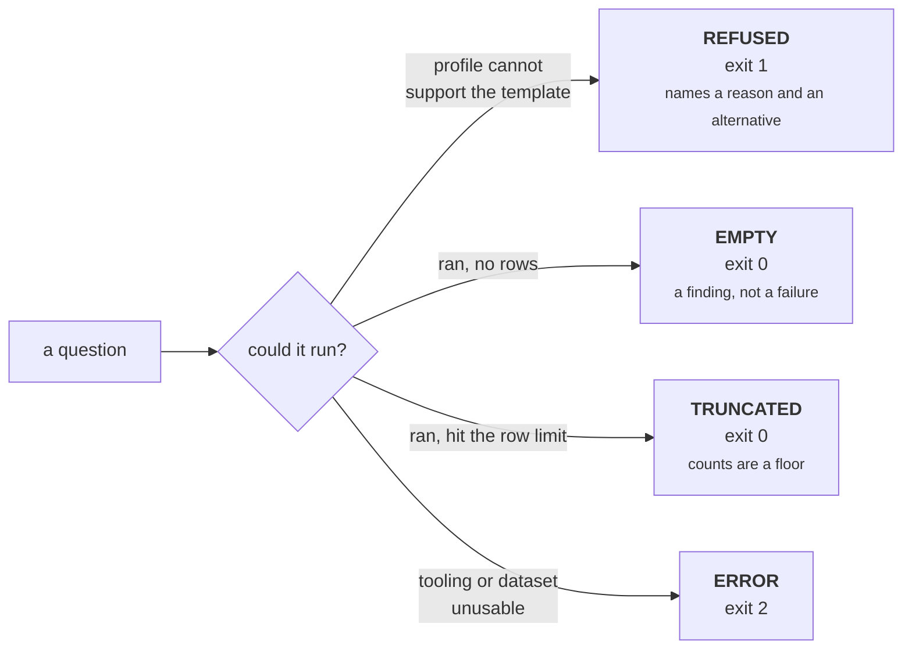
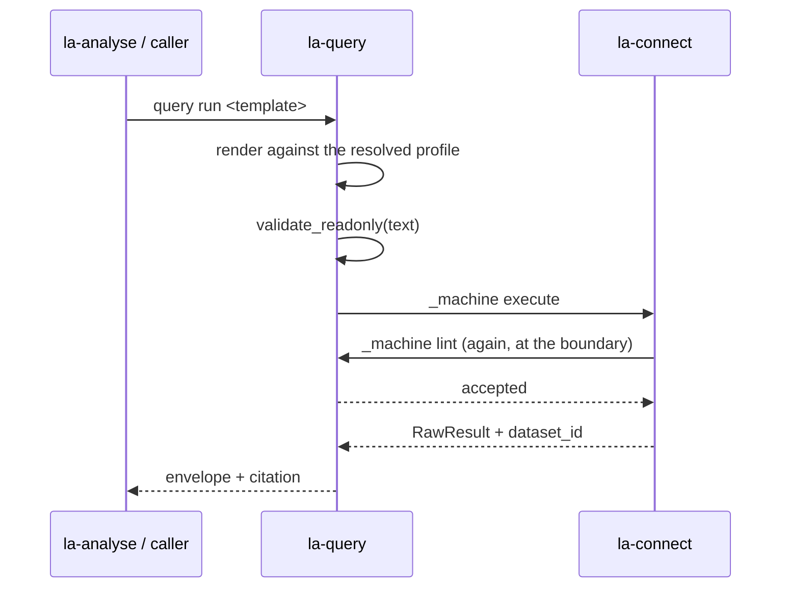

# Evidence and refusal

Two ideas carry most of this package. An answer must be checkable, and the three ways of having no
answer must stay distinguishable.

## The result envelope

Every execution produces an envelope. `--format json` emits it whole; the tabular formats print its
rows and put the rest in a citation line.

```
schema_version, query, query_id, dataset_id, profile_id, profile_version, executed_at,
elapsed_ms, row_count, load_ms, truncated, template, form, variables, rows, boolean,
triples, warnings
```

`schema_version` is `1`, and it is the wire version `la-analyse bundle` checks before reading a
step.

### The citation line

```
core/models | query 4ae81572f06e | dataset base.trig | profile linked-archi-default v2 | 2026-09-16T23:24:55.552005+00:00 | 2 row(s)
```

Six pipe-separated fields, in this order:

1. The template name, or the literal `ad-hoc query` for `query literal`.
2. `query ` plus the first 12 hex characters of `query_id`.
3. `dataset ` plus the dataset identity reported by `linked-archi-connect`.
4. `profile ` plus the profile name and ` v` plus its version — one field, two values.
5. `executed_at`, a UTC ISO-8601 timestamp with microseconds and a `+00:00` offset.
6. The cost: `<n> row(s)`.

A seventh field appears **only when loading took 250 ms or more**, so a slow load cannot hide
behind a fast query:

```
... | 12 row(s) | load 1840 ms, query 26 ms
```

In `--format tsv` the line is prefixed `# `; in `--format md` it is not.

### `query_id`

A SHA-256 over the query text with whitespace collapsed. Re-indenting a template does not change
it; changing an IRI, a limit or a graph does. Two answers citing the same `query_id` ran the same
question.

## Output formats

`FORMATS = ("tsv", "md", "json")`, default `tsv`. `--format` wins over `--json`; `-o` always writes
JSON regardless of `--format`, because an artifact is a record that `query batch` and
`la-analyse bundle` read back.

=== "tsv (default)"

    ```
    model	label
    urn:uuid:1	Archisurance
    urn:uuid:2	Errata
    #
    # 2 row(s)
    # core/models | query 4ae81572f06e | dataset base.trig | profile linked-archi-default v2 | ... | 2 row(s)
    ```

    The separator is `#`, not a blank line, so `grep -v '^#'` leaves exactly the header and the
    rows. Cells escape `\`, tab, CR and LF.

=== "md"

    ```
    | model      | label        |
    |------------|--------------|
    | urn:uuid:1 | Archisurance |
    | urn:uuid:2 | Errata       |
    2 row(s)

    core/models | query 4ae81572f06e | dataset base.trig | profile linked-archi-default v2 | ... | 2 row(s)
    ```

=== "json"

    The full envelope, `indent=2`. This is what `-o` writes and what the analyse bundler reads.

Values are identical in all three: the adapters flatten RDF terms to lexical form, so none of them
is a W3C SPARQL results document.

## Three kinds of nothing



**Refused** is a routing answer. Read the reason, run the named alternative.

**Empty** prints guidance rather than a bare blank, because an empty table reads as absence:

```
(no rows)

An empty result is a finding, not a failure. Before reporting 'none', confirm with the
orientation templates that the data you expect is loaded and in scope - an empty graph and a
graph with no matching elements look identical from here.
```

For a hand-written query it adds the lint hint, because a query that returned nothing is far more
often broken than evidence of absence:

```
If this query was hand-written or adapted, lint it against the shapes before concluding
anything: `la-query lint --query '...' --data <the same data>`. That reports whether the path
is one the metamodel permits - reversing source and target returns nothing silently, and the
qualified form is the default. Graph scope is worth checking by eye either way.
```

**Truncated** means the result hit the query's own row limit, so any count is a floor. The note is
printed **before** the rows as well as after them:

```
# NOTE: showing 1 of 3 row(s) and the result hit the query's row limit, so counts here are a
floor - report 'at least', and never read absence from this result.
```

`truncated` is computed from the *rendered query's* limit, not from `--limit`. `--limit` is a
display cap only: it does not bound the query, the work, or what `-o` and `--json` write. The
query's own cap is `--set LIMIT=N`.

## Read-only enforcement

Read-only is enforced rather than requested, and in one place: `linked-archi-query` owns the lint,
and `linked-archi-connect` calls back into it through `_machine lint` before executing anything.
A query that is not read-only is refused with exit 1.



## The path check

`la-query lint` reports a query's form and refuses anything not read-only. With `--data` it also
asks whether the path the query walks is one the metamodel permits, read from the published SHACL
attached to the dataset.

```bash
python3 scripts/la-query lint --query 'PREFIX bs: <https://meta.linked.archi/backstage/onto#>
SELECT * WHERE { ?s a bs:Component ; bs:ownedBy ?o . ?o a bs:Component }' \
    --profile curated-store --data fixtures/shapes.ttl --data fixtures/vocabulary.ttl
```

```
OK: read-only (inline query)
paths: 1 impossible path(s) in 1 checked
  ! ownedBy may not point at Component; permitted: Group, User
  caveat: verdicts assume each attached shape document is whole. Only the presence of every
    declared shape namespace could be verified - one shape of 28 would pass that test - so a
    partial attachment can still produce a wrong verdict
```

Three rules are checked: the subject's declared class is permitted as a **source** of that
predicate, the object's class is permitted as a **target**, and where both ends are typed, the
exact `(source, predicate) -> target` **pair**.

A violation reports and exits 0. An impossible path is a finding, not a refusal: the query is still
legal SPARQL and the caller may have reason to run it.

!!! warning "Every verdict is provisional, and says so"
    What can be verified is that every shape namespace a metamodel manifest declares has shapes
    attached. That proves a set is *partial* when a namespace is empty; it cannot prove one is
    *whole*, because nothing published states how many shapes a document holds — one shape of 28
    passes the test. So a partial attachment can still produce a wrong verdict, and every report
    that judged anything carries the caveat above.

## Verification decay

A profile is a set of claims about a dataset. Reload the dataset and nobody has checked them since.
Until `la-profile verify` is re-run, every result carries:

```
# caveat: profile 'linked-archi-default' has not been verified against this dataset. A profile
that does not fit fails silently - scoped queries return nothing, or rows that mean something
else. Check it with: la-profile verify --profile linked-archi-default --data ...
```

That caveat is load-bearing, not decoration. It travels into `la-analyse bundle`, which reports
`profile.verified` on the artifact and prints its own caveat when the marker is missing.
