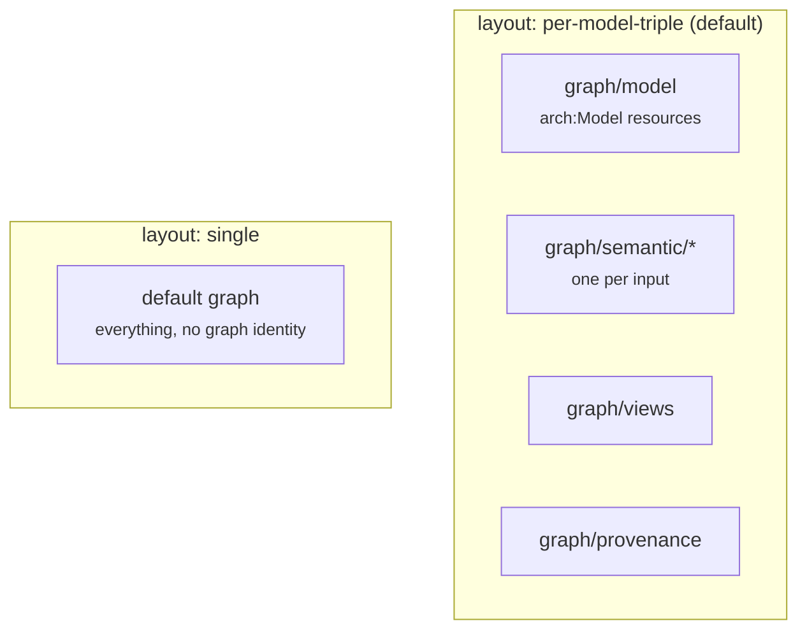
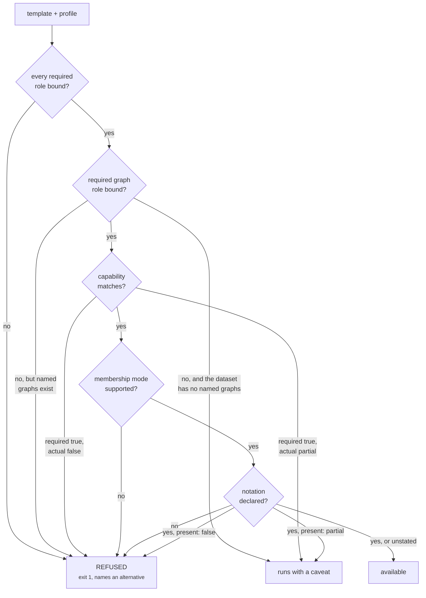
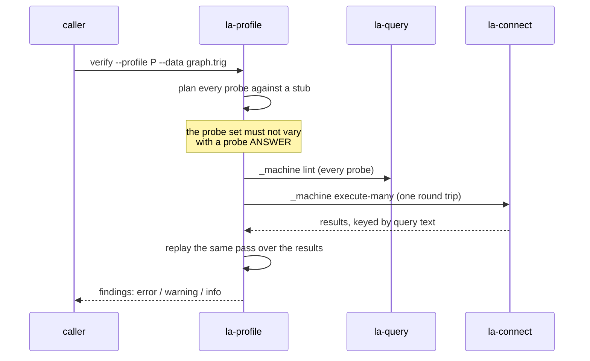

# The graph profile

A profile is the answer to one question: **what does this dataset call things?**

Two graphs converted from the same ArchiMate model can differ in namespace, graph layout,
relationship form and membership predicate, all legitimately, depending on converter flags. A
template written against one of them returns nothing against the other — silently. The profile is
what makes a template portable, and what lets the catalogue refuse a template the dataset cannot
support instead of running it into an empty result.

Concretely, a profile decides five things, and a template can express none of them itself:

1. **Which IRI each vocabulary term is** — the [roles](#what-a-role-is). A template says "the label
   predicate", the profile says `skos:prefLabel`.
2. **Where the facts live** — the graph layout and graph roles, which decide whether a query is
   wrapped in `GRAPH ?g_semantic { … }` or left unscoped.
3. **What the dataset can support** — the capabilities and notation presence, which decide whether a
   template runs, runs with a caveat, or is refused.
4. **What "belongs to a model" means** — the membership mode: a direct edge, co-location in a graph,
   or a bounded folder path.
5. **How big an answer may get** — the row limits and timeout.

Everything else in the file is naming and provenance around those five.

## What a profile document contains

Every section is optional, and `extends` is resolved depth-first before validation.

| Section | Type | Purpose |
|---|---|---|
| `profile` | string | The name. Defaults to the file stem, then `anonymous`. |
| `version` | positive int | Declared version, default `1`. Deliberately **not** part of the fingerprint. |
| `description` | string | What this profile describes. |
| `base_iri` | string | The minted-IRI base. |
| `extends` | path | Parent profile, resolved before construction. |
| `namespaces` | map | Prefix to IRI. Names and values are stripped and must be non-empty. |
| `roles` | map | Role name to one IRI, a non-empty list of IRIs in preference order, or `null`. |
| `graphs` | map | `layout`, `named_graphs`, `roles`, `required`, `descendants`. |
| `capabilities` | map | `true`, `false` or `"partial"`. `label_language` is a string instead. |
| `notations` | map | Slug to a spec: `label`, `metamodel`, `namespace`, `native_id`, `present`. |
| `taxonomies` | list | SKOS concept schemes available for classification queries. |
| `navigation` | map | Only `model_membership`, and inside it only `mode` and `max_depth`. |
| `limits` | map | `default_row_limit`, `max_row_limit`, `timeout_ms`. |

The bundled `linked-archi-default` binds **59 roles**, 4 graph roles and 14 capabilities.

!!! note "Any other key under `graphs` becomes a graph role"
    The guard list is exactly `layout`, `named_graphs`, `roles`, `required`, `descendants`.
    Anything else under `graphs` is folded in as a graph role, which is how `validation:` and
    `vocabulary:` are declared unbound in the default profile.

## What a role is

**A role is a name a template uses instead of a vocabulary term.** The template says "the label
predicate"; the profile says which IRI that is for this dataset. No template in the catalogue names
`skos:prefLabel`, `arch:source` or `bpmn:id` directly — that is the rule the whole design rests on,
because a template that names a term is a template that works on one dataset.

```yaml
roles:
  label: skos:prefLabel                    # one IRI
  native_id: [skos:notation, bpmn:id]      # a list, in preference order
  owner: null                              # declared, deliberately unbound
```

Three binding shapes, and the difference between them is behaviour, not style:

| Binding | Means | Effect at render time |
|---|---|---|
| one IRI | this dataset uses exactly that term | substituted directly |
| a list | several terms mean this, in preference order | becomes a SPARQL alternative path |
| `null` | this dataset has nothing for it | any template requiring the role is **refused** |

`native_id` is a list because BPMN carries its own identifier predicate while every other notation
uses `skos:notation`. `owner` is `null` because converter output records no ownership — so
`core/coverage-gaps` asking about owners is refused with a reason, rather than run to return nothing.

### The 59 roles the default profile binds

Grouped by what they describe. This is the whole vocabulary surface a template is allowed to touch.

| Group | Roles |
|---|---|
| **Naming** | `label`, `alt_label`, `definition`, `native_id` |
| **Classes** | `concept_class`, `element_class`, `relationship_class`, `model_class`, `view_class`, `diagram_class`, `folder_class` |
| **Relationship form** | `rel_source`, `rel_target`, `rel_type`, `has_qualified_rel`, `reifies`, `unqualified_form` |
| **Containment** | `part_of_model`, `part_of`, `has_part`, `folder_name` |
| **Source description** | `bundle_class`, `qualified_derivation`, `source_path`, `source_repo`, `source_digest`, `source_alternate`, `source_url`, `source_email` |
| **Conformance** | `conforms_to_metamodel`, `conforms_to_viewpoint` |
| **Views and geometry** | `view_node_class`, `view_link_class`, `view_ref`, `node_element`, `in_view`, `link_relationship`, `link_source`, `link_target`, `bounds_x`, `bounds_y` |
| **Provenance** | `derived_from`, `generated_by`, `generated_at`, `attributed_to`, `source_file`, `agent_name`, `agent_version` |
| **Taxonomy and schema** | `broader`, `narrower`, `in_scheme`, `keywords`, `subclass_of` |
| **Lifecycle** | `model_status`, `element_lifecycle`, `architecture_state` |
| **Unbound by default** | `owner`, `same_as`, `exact_match` |

`la-profile show` prints the bindings for any profile, and `la-query catalog show <template>` lists
the roles a given template requires.

## How a template becomes SPARQL

A template is not a query. It is a query with holes, and the profile fills them. Eight directives
exist, and nothing else is substituted:

| Directive | Expands to |
|---|---|
| `{{PREFIXES}}` | the profile's whole namespace map as `PREFIX` lines |
| `{{ROLE:x}}` | the primary IRI bound to role `x` |
| `{{ROLES:x}}` | every IRI bound to `x`, space-separated, for a `VALUES` block |
| `{{PATH:x}}` | every IRI bound to `x` as an alternative path, `a|b` |
| `{{GRAPH_OPEN:role}}` / `{{GRAPH_CLOSE}}` | the graph wrapper this profile's layout calls for |
| `{{GRAPH_VAR:role}}` | the variable that scope binds, `?g_<role>` |
| `{{MEMBERSHIP:var}}` | the "belongs to a model" pattern for this profile's membership mode |

Plus `{{PARAM}}` for typed user input, which is type-checked and escaped rather than pasted — a raw
string replace on user input is an injection hole, and it also forces the caller to supply their own
angle brackets.

!!! note "One graph variable per role, not one per template"
    `{{GRAPH_VAR:semantic}}` is `?g_semantic`. A template scoping to two roles — an element's facts
    in the semantic graph, its provenance in the provenance graph — would otherwise bind both with
    `?g` and require one graph IRI to end in two different suffixes at once. That is unsatisfiable,
    so the query runs and returns nothing: exactly the failure this package exists to remove,
    reintroduced by the mechanism meant to prevent it.

### Seen concretely

`core/neighbours-qualified`, as shipped (`la-query catalog show core/neighbours-qualified --source`):

```sparql
{{PREFIXES}}
SELECT ?direction ?rel ?relType ?other ?otherLabel
WHERE {
  {{GRAPH_OPEN:semantic}}
    VALUES ?focus { {{FOCUS_IRI}} }
    ?rel a {{ROLE:relationship_class}} .
    {
      ?rel {{ROLE:rel_source}} ?focus ; {{ROLE:rel_target}} ?other .
      BIND("outgoing" AS ?direction)
    }
    ...
    OPTIONAL { ?other {{PATH:label}} ?otherLabel }
  {{GRAPH_CLOSE}}
}
LIMIT {{LIMIT}}
```

The same template, rendered under two profiles. Comments and the 30 injected `PREFIX` lines are
trimmed; nothing else is edited.

=== "linked-archi-default"

    ```sparql
    SELECT ?direction ?rel ?relType ?other ?otherLabel
    WHERE {
      GRAPH ?g_semantic {
        FILTER(STRENDS(STR(?g_semantic), "graph/semantic") || CONTAINS(STR(?g_semantic), "graph/semantic/"))
        VALUES ?focus { <https://example.org/x> }
        ?rel a <https://meta.linked.archi/core#QualifiedRelationship> .
        {
          ?rel <https://meta.linked.archi/core#source> ?focus ; <https://meta.linked.archi/core#target> ?other .
          BIND("outgoing" AS ?direction)
        }
    ```

=== "examples/flattened-turtle"

    ```sparql
    SELECT ?direction ?rel ?relType ?other ?otherLabel
    WHERE {
      {
        VALUES ?focus { <https://example.org/x> }
        ?rel a <https://meta.linked.archi/core#QualifiedRelationship> .
        {
          ?rel <https://meta.linked.archi/core#source> ?focus ; <https://meta.linked.archi/core#target> ?other .
          BIND("outgoing" AS ?direction)
        }
    ```

    Rendering also emits a caveat, because answering unscoped is a compromise rather than a
    preference:

    ```
    caveat: profile has no named graphs, so the 'semantic' scope cannot be applied. The query
    will run unscoped, which mixes semantic, view and provenance facts in one result.
    ```

`{{GRAPH_OPEN:semantic}}` became a `GRAPH` block with a suffix filter under one profile and a plain
group under the other. Roles expanded to full IRIs in both. One template, two datasets, no edit.

### A list-bound role and a membership mode

`{{PATH:native_id}}` under the default profile, where `native_id` binds two IRIs:

```sparql
OPTIONAL { ?element <http://www.w3.org/2004/02/skos/core#notation>|<https://meta.linked.archi/bpmn/onto#id> ?nativeId }
```

`{{MEMBERSHIP:element}}` is the clearest case of the profile carrying a *decision* rather than a
term. Same template, three `navigation.model_membership.mode` values:

| Mode | Renders as |
|---|---|
| `direct-predicate` | `OPTIONAL { ?element <…core#inModel> ?model . }` |
| `same-graph-colocation` | `OPTIONAL { ?model a <…core#Model> . }` |
| `bounded-folder-tree` | `OPTIONAL { ?element (<dct:isPartOf>\|<dct:isPartOf>/<dct:isPartOf>\|<dct:isPartOf>/<dct:isPartOf>/<dct:isPartOf>) ?model . }` |

A one-hop edge, co-location in a graph, or a bounded path of up to `max_depth` folder hops. The
template asks "which model does this belong to" and never learns which of the three answered.

## Graph layout



Turtle carries no graph identity, so a Turtle export lands entirely in the default graph. That is
why `examples/flattened-turtle` exists with `layout: single`: under it a scoped question is
answered unscoped, with a caveat, rather than returning nothing. `la-connect` says so at load
time, verbatim:

```
warning: no named graphs in this dataset. Use a profile with layout 'single' from sibling
linked-archi-profile/assets/profiles/ or every scoped query returns nothing.
```

## Capabilities

A capability is a claim about the dataset, taking `true`, `false` or `"partial"`. `partial` means
present for some models and absent for others — a template requiring a partial capability runs and
carries a warning.

| Capability | Default profile | What it claims |
|---|---|---|
| `model_graph` | `true` | Model resources live in their own graph. |
| `part_of_model_edge` | `true` | A direct membership edge exists. |
| `graph_bundles` | `true` | Named graphs are described as `prov:Bundle`. |
| `partitioned_semantic_graphs` | `true` | One semantic graph per input. |
| `direct_rel_triples` | `false` | The direct source-predicate-target triple exists beside the qualified form. |
| `rdf_reifies` | `false` | The RDF 1.2 reification bridge is present. |
| `views_graph` | `partial` | Diagrams are present, for some notations. |
| `provenance_graph` | `true` | A provenance graph is present. |
| `view_geometry` | `partial` | Node bounds are recorded. |
| `identity_assertions` | `false` | Cross-source identity has been asserted. |
| `element_lifecycle` | `partial` | Element-level lifecycle status is recorded. |
| `concept_owner` | `false` | Ownership is recorded on concepts. |
| `validation_in_graph` | `false` | A SHACL report is loaded as a named graph. |
| `label_language` | `en` | Language tag to prefer for labels. |

There is no whitelist of capability names: any name is legal, and an undeclared capability reads as
absent on purpose.

## Notations, and whether the data holds any

A notation spec says the profile can speak that notation. It is matched on the **namespace IRI**,
never the slug: ArchiMate's slug in the default profile is `model`, because the converter's
`--path-model` defaults to that and is configurable.

```yaml
notations:
  bpmn:
    label: BPMN 2.0
    metamodel: https://meta.linked.archi/bpmn/metamodel#BPMN2
    namespace: bpmn
    native_id: bpmn:id
    present: false        # this dataset holds no BPMN
```

`present` is a claim about the dataset in the same sense a capability is:

- `false` — every template written against that notation is **refused**, naming the notation
  rather than returning an empty table that implies absence.
- `partial` — runs with a caveat.
- `true` — changes nothing. The claim can only ever remove an answer, never manufacture one.
- **absent** — unknown, and nothing is refused on an unknown. A profile that never mentions
  presence behaves exactly as it did before the key existed.

`la-profile verify` measures it and reports which notations have models. It is a warning, never an
error: no dataset is obliged to hold every notation a profile can read.

## How gating decides



A refusal always names why and, where the catalogue declares one, what to run instead:

```
Template 'notation/bpmn/process-flow' cannot run against profile 'no-bpmn':
  - profile 'no-bpmn' declares notation 'bpmn' but records it as absent from this dataset, so no
    model this bpmn template asks about is here. Refused rather than answered with no rows, which
    would read as 'none exist'. Confirm with core/inventory-summary, and if the notation is in
    fact loaded, set notations.bpmn.present true - `la-profile verify` reports which notations
    have models here.
This is a refusal, not an empty result: running it anyway would return no rows and read as
'nothing exists'.
```

## The bundled profiles

| Profile | Extends | Describes |
|---|---|---|
| `linked-archi-default` | — | Converter output with default flags: qualified relationships only, model resources in their own graph, a semantic graph per input, membership as a direct `arch:inModel` edge. |
| `linked-archi-direct` | default | Output with `--emit-direct-rel-triples`. Traversal templates become available; double-counting becomes possible. |
| `linked-archi-merged` | default | Merged multi-model store with an authored reconciliation graph. |
| `examples/curated-store` | merged | Reconciliation graph, direct triples and a loaded SHACL report. The profile `fixtures/augmented.trig` is built for. |
| `examples/flattened-turtle` | default | `layout: single`. Graph-scoped questions answered unscoped, with a caveat. |
| `examples/with-vocabulary` | default | Converter output plus the published ontologies and taxonomies paired as Turtle beside it, so schema-level questions become answerable. |
| `examples/cloudplatform` | default | A custom metamodel extending ArchiMate 4.0, reached through derivation rather than a fork. |

## Verifying the claims



Findings carry a severity, and only `error` moves the exit code:

| Severity | Meaning | Exit |
|---|---|---|
| `error` | A claim in the profile is false about this dataset. | 1 |
| `warning` | A bound role is unused here, or drift worth knowing. | 0 |
| `info` | Confirmed. Hidden unless `--all`. | 0 |

Where a fix is unambiguous, the finding carries it and `--emit-fix` writes a child profile
overriding only the contradicted claims:

```bash
python3 scripts/la-profile verify --profile linked-archi-default --data graph.trig \
    --emit-fix > my-graph.yaml
```

Unused roles and missing graph roles are explicitly not mechanically fixable, and are reported for
a human to decide.

!!! info "The verification marker"
    A clean verification writes a marker keyed on the SHA-256 of
    `dataset_id`, `profile.name` and the profile **fingerprint** — not the declared `version`. The
    fingerprint covers `base_iri`, `namespaces`, `roles`, `graphs`, `capabilities`, `notations`,
    `taxonomies` and `navigation`, so editing any of them invalidates the marker automatically.
    Until a marker exists, every query result carries a caveat saying the profile was never
    verified against this dataset.
