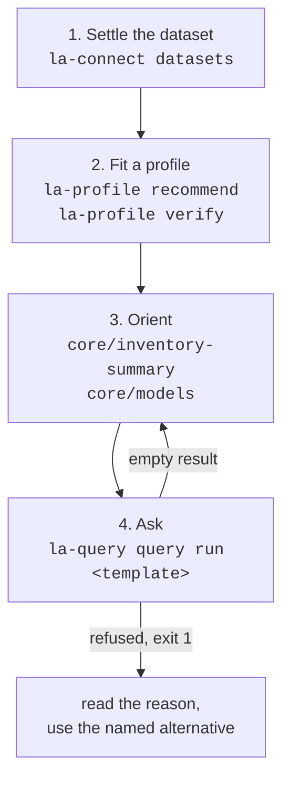

# Getting started

## Install

The package is an [APM](https://microsoft.github.io/apm/) bundle. The committed tree is the
artifact: there is no build step and no install-time bundling.

```bash
apm install linked-archi/linked-archi-apm#v0.6.0
apm install .                    # from a local clone
```

`apm targets` shows what auto-detection resolves to before you commit to it. Naming harnesses
explicitly, or redirecting where files land:

```bash
apm install . --target claude,codex,kiro   # or -t all
apm install . --root /tmp/apm-out          # redirect every write under a directory
apm install . -g --target kiro             # user scope (~/.apm/)
```

## Requirements

Python 3.11 or newer, and every skill states that in its own frontmatter. CI tests 3.11, 3.12 and
3.13 — the floor and the current ceiling, since those are the two that break.

| Dependency | Needed for | Without it |
|---|---|---|
| `PyYAML` | reading profiles | the profile owner cannot load anything |
| `pyoxigraph` | local file execution | endpoints still work; local files do not |
| `pyshacl` (pulls `rdflib`) | `la-validate run` | `la-validate doctor` reports MISSING and SHACL tests skip |
| `rdflib` | the path check in `la-query lint --data` | lint reports `not checked: rdflib is not installed` |

```bash
pip install PyYAML pyoxigraph pyshacl
```

## Check the tooling before blaming the data

Every skill has a `doctor`. It reports where the skill is, which companions it resolved, and what
is missing. Real output:

```console
$ python3 scripts/la-query doctor
linked-archi-query
  owner root:   .../skills/linked-archi-query
  command:      .../skills/linked-archi-query/scripts/la-query
  templates:    39 in .../skills/linked-archi-query/assets/templates
  skills dir:   (unset; resolving beside this skill)
  dataset env:  (unset)
  la-profile    .../skills/linked-archi-profile/scripts/la-profile  (resolves the profile for render and run)
  la-connect    .../skills/linked-archi-connect/scripts/la-connect  (executes against a dataset or endpoint)
Catalogue browsing and lint work alone. Rendering needs the profile owner;
execution additionally needs the connect owner. Resolution order is
$LINKED_ARCHI_SKILLS_DIR (authoritative), then the sibling directory beside this
skill, then PATH - never a filesystem search.
```

Companion resolution never searches the filesystem. The order is
`$LINKED_ARCHI_SKILLS_DIR` (authoritative — when set, it does not fall back), then the sibling
directory beside the skill, then `PATH`.

## The four steps, in order



**1. Settle the dataset.** `la-connect datasets` lists candidates and selects none of them. Nothing
is chosen for you, because answering from a file nobody picked is the one failure that cannot be
detected afterwards — the result looks sound and cites the wrong architecture.

```bash
python3 scripts/la-connect datasets
python3 scripts/la-connect connect --data graph.trig
```

Several `--data` flags merge into one store with one dataset identity. `--data` and `--endpoint`
together are refused: two datasets would make the recorded identity wrong.

**2. Fit a profile.** The profile says what this dataset calls things. Ask for a recommendation,
then verify it:

```bash
python3 scripts/la-profile recommend --data graph.trig
python3 scripts/la-profile verify --profile linked-archi-default --data graph.trig
```

`recommend` never applies anything. `verify` exits 1 when a claim in the profile is false about the
dataset, which is a finding to act on rather than a crash.

**3. Orient.** Once per session, not once per question:

```bash
python3 scripts/la-query query run core/inventory-summary --data graph.trig
python3 scripts/la-query query run core/models --data graph.trig
```

**4. Ask.** Resolve names before using them, then run a template:

```bash
python3 scripts/la-query query run core/resolve-element --data graph.trig --set TERM="order service"
python3 scripts/la-query query run core/neighbours-qualified --data graph.trig \
    --set FOCUS_IRI=https://example.org/la/bpmn/order-handling/element/task-1
```

## Trying it against the bundled fixtures

The repository ships extracted fixtures, so every command above can be run before any real dataset
exists. `fixtures/base.trig` is converter output with default flags; `fixtures/augmented.trig` adds
a reconciliation graph, direct relationship triples and a loaded SHACL report.

```bash
make verify           # the default profile against base.trig
make verify-curated   # the curated profile against augmented.trig
make catalog          # list the template library
```

!!! warning "Fixtures are for testing this package, not for answering questions"
    `la-connect datasets` excludes paths containing `fixtures`, `test`, `example` or `sample`
    unless `--include-fixtures` is passed. Falling back to them when a real dataset is missing
    would produce a confident answer about the wrong architecture.
