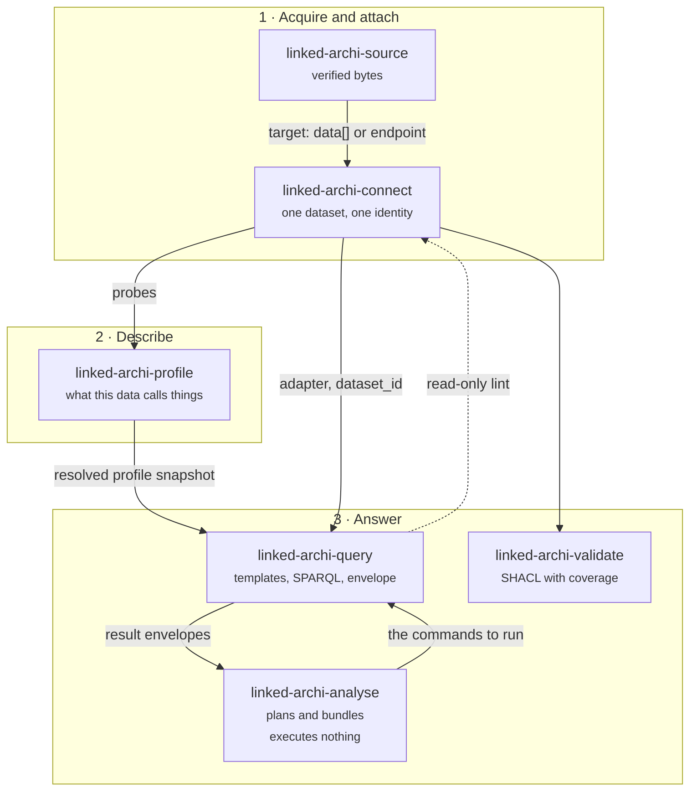

# Linked.Archi APM

Six [Agent Skills](https://github.com/linked-archi/linked-archi-apm) that let an AI agent answer
questions about an enterprise architecture from an RDF knowledge graph, and attach the query, the
dataset identity and the profile version to every answer it gives.

The graph is produced by the Linked.Archi converters from ArchiMate, BPMN, C4 or Structurizr,
Backstage and LeanIX models, against the published ontologies at
[meta.linked.archi](https://meta.linked.archi).

## The problem this package exists for

An architecture question answered from a model file is unfalsifiable. The reader cannot tell a
correct answer from a plausible one, and the two failure modes look identical:

- **An empty result reads as absence.** "No capability is unrealised" and "no capability is
  modelled" are different statements, and a query returning zero rows produces both.
- **A wrong vocabulary returns nothing, silently.** Scope a query to a named graph the dataset
  does not have and it succeeds with no rows.

Every design decision here follows from refusing to let those two look like answers.

## The six skills



| Skill | Owns | Never does |
|---|---|---|
| `linked-archi-source` | Acquiring RDF from HTTPS, a pinned Git revision, or a read-only GitLab MCP handoff. Digest, size, redirect and parse verification. | Executes no SPARQL. |
| `linked-archi-connect` | Dataset discovery, attachment and identity. Local pyoxigraph store or SPARQL endpoint. | Chooses no dataset for you. |
| `linked-archi-profile` | The graph profile: namespaces, roles, graph layout, capabilities, notations. Verifies its claims against real data. | Never applies a recommendation. |
| `linked-archi-query` | The 39-template catalogue, rendering, read-only enforcement, execution, and the result envelope. | Invents no IRI. |
| `linked-archi-validate` | SHACL in-process, plus reading a report someone else produced. Target-class coverage beside the verdict. | Needs no JVM or converter. |
| `linked-archi-analyse` | Routing a question to an analysis pattern, planning the ordered steps, bundling the envelopes. | **Executes nothing.** |

## What an answer looks like

Every result carries a citation line naming what ran, against what, under which profile:

```
model	label
urn:uuid:1	Archisurance
urn:uuid:2	Errata
#
# 2 row(s)
# core/models | query 4ae81572f06e | dataset base.trig | profile linked-archi-default v2 | 2026-09-16T23:24:55.552005+00:00 | 2 row(s)
```

`query 4ae81572f06e` is a SHA-256 over the query with whitespace collapsed, so re-indenting a
template does not change it but changing an IRI or a limit does. See
[Evidence and refusal](concepts/evidence.md).

## Three properties worth knowing before you start

**A template can be refused, and a refusal is an answer.** The catalogue declares what each
template needs — profile roles, graph roles, capabilities, a notation's vocabulary and whether the
dataset holds any of it. When the profile cannot support a template, it is refused with a reason
and a named alternative, on exit code 1. That is routing, not a crash. See
[The graph profile](concepts/profile.md).

**Read-only is enforced, not requested.** Every query is linted before execution, including
queries that arrive through the analyse skill's plans and through `connect`'s machine contract.

**The profile is a set of claims, and claims decay.** `la-profile verify` probes the dataset and
reports where a claim is false. Until a profile has been verified against a dataset, every result
from it carries a caveat saying so.

## Where to go next

- [Getting started](getting-started.md) — install, check the tooling, run the first query.
- [Conversational analysis](walkthrough.md) — a question in natural language turned into a
  planned series of catalogued queries and a fact-grounded answer.
- [Template catalogue](templates.md) — all 39 templates, what each answers and what it does not
  prove.
