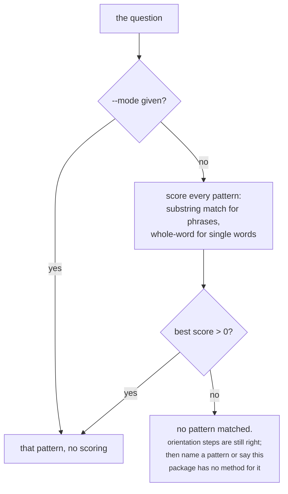

# Analysis patterns

Nine patterns, each a method for a kind of architecture question: which templates to run, what gates
them, and — the part that matters most — **when to stop**.

`assets/patterns.json` is the authoritative routing table. The prose under `references/patterns/` is
the depth behind each entry, and the suite tests the two against each other: every pattern has a
reference file that exists, and every template it names is in the query catalogue. A pattern naming
a template nobody ships is a routing instruction to nowhere.

```bash
python3 scripts/la-analyse plan --list-patterns
python3 scripts/la-analyse plan --question 'what depends on "Order Service"?' --mode impact-and-dependency
```

## How a question reaches a pattern



A zero score everywhere is a real answer, not a failure: the question does not look like anything
this skill has a method for.

!!! note "`capabilities` here is advisory"
    The authoritative gate is the query catalogue's own `requires`, checked at render time. The
    pattern lists capabilities so a planner can say "this dataset cannot answer that" before running
    anything.

## The nine patterns

### `coverage-and-gaps`

**Coverage and gaps.** Depth: [`references/patterns/coverage-and-gaps.md`](https://github.com/linked-archi/linked-archi-apm/blob/main/skills/linked-archi-analyse/references/patterns/coverage-and-gaps.md)

*Triggers:* `uncovered`, `coverage`, `incomplete`, `gap`, `gaps`, `missing`, `no owner`, `without an owner`, `unowned`, `how many have`

*Templates, in the order the plan runs them:*

- `core/inventory`
- `core/elements-by-type`
- `core/element-detail`
- `core/coverage-gaps`
- `core/orphans`

*Stop when:*

- the population is empty, which produces zero gaps and looks like perfect coverage
- the gap concentrates in one model, which is a partial export rather than an ownership problem

### `cross-notation`

**Cross-notation questions.** Depth: [`references/patterns/cross-notation.md`](https://github.com/linked-archi/linked-archi-apm/blob/main/skills/linked-archi-analyse/references/patterns/cross-notation.md)

*Triggers:* `reconcile`, `same system`, `same thing`, `both tools`, `across tools`, `bpmn to archimate`, `backstage to c4`, `identity`

*Templates, in the order the plan runs them:*

- `core/identity-audit` — gated on `identity_assertions`
- `core/label-collisions`
- `core/inventory-summary`

*Capability gates:* `identity_assertions` (core/identity-audit only)

*Stop when:*

- identity-audit is refused, which means the dataset has no reconciliation and the join cannot be made
- only label candidates remain - report them as candidates and stop

### `governance-and-decisions`

**Governance and decisions.** Depth: [`references/patterns/governance-and-decisions.md`](https://github.com/linked-archi/linked-archi-apm/blob/main/skills/linked-archi-analyse/references/patterns/governance-and-decisions.md)

*Triggers:* `decision`, `principle`, `standard`, `policy`, `exception`, `constraint`, `approved`, `governance`, `compliant`

*Templates, in the order the plan runs them:*

- `core/discover-predicates`
- `core/element-detail`
- `core/classified-by`
- `core/provenance`

*Stop when:*

- no predicate in this dataset carries decisions or policies at all
- the only status found describes the conversion rather than the architecture

### `impact-and-dependency`

**Impact and dependency.** Depth: [`references/patterns/impact-and-dependency.md`](https://github.com/linked-archi/linked-archi-apm/blob/main/skills/linked-archi-analyse/references/patterns/impact-and-dependency.md)

*Triggers:* `retire`, `replace`, `migrate`, `decommission`, `affected by`, `depends on`, `dependency`, `blast radius`, `impact`

*Templates, in the order the plan runs them:*

- `core/resolve-element`
- `core/discover-relationship-types`
- `core/neighbours-qualified`
- `core/dependents-qualified`
- `core/dependents-direct` — gated on `direct_rel_triples`
- `core/provenance`

*Capability gates:* `direct_rel_triples` (core/dependents-direct only)

*Stop when:*

- the relationship semantics on a path stop supporting the claim
- reachability has been established but criticality has not - they are different questions
- the next hop needs data the models do not carry, such as traffic or failure history

### `lifecycle-and-portfolio`

**Lifecycle and portfolio comparison.** Depth: [`references/patterns/lifecycle-and-portfolio.md`](https://github.com/linked-archi/linked-archi-apm/blob/main/skills/linked-archi-analyse/references/patterns/lifecycle-and-portfolio.md)

*Triggers:* `duplicate`, `duplicates`, `overlap`, `rationalise`, `rationalize`, `lifecycle`, `deprecated`, `portfolio`, `strategic importance`

*Templates, in the order the plan runs them:*

- `core/lifecycle` — gated on `element_lifecycle`
- `core/define-term`
- `core/label-collisions`
- `core/identity-audit` — gated on `identity_assertions`
- `notation/leanix/factsheets`

*Capability gates:* `element_lifecycle` (core/lifecycle only); `identity_assertions` (core/identity-audit only)

*Stop when:*

- equivalence rests on labels alone - say the question is not answerable yet
- lifecycle is absent for most of the population, so the listed subset is not a portfolio view

### `model-contents`

**What a model contains.** Depth: [`references/patterns/model-contents.md`](https://github.com/linked-archi/linked-archi-apm/blob/main/skills/linked-archi-analyse/references/patterns/model-contents.md)

*Triggers:* `what is in`, `what does this model cover`, `take part`, `takes part`, `participate`, `who is involved`, `contents`, `components`

*Templates, in the order the plan runs them:*

- `core/inventory-summary`
- `core/resolve-model`
- `core/define-term`
- `notation/bpmn/process-components`
- `notation/bpmn/process-flow`
- `notation/c4/containers`

*Stop when:*

- the model is drawn at a level of detail that hides what was asked about
- a participant has been listed - that is a drawn intent, not a running system

### `model-quality`

**Model quality.** Depth: [`references/patterns/model-quality.md`](https://github.com/linked-archi/linked-archi-apm/blob/main/skills/linked-archi-analyse/references/patterns/model-quality.md)

*Triggers:* `can we trust`, `trust`, `quality`, `complete`, `wrong with`, `orphan`, `orphans`, `conformance`, `conform`

*Templates, in the order the plan runs them:*

- `core/inventory-summary`
- `core/orphans`
- `core/coverage-gaps`
- `core/provenance`
- `core/identity-audit`
- `core/validation-summary` — gated on `validation_in_graph`

*Capability gates:* `validation_in_graph` (core/validation-summary only)

*Stop when:*

- the question turns out to be about conformance against shapes - hand it to linked-archi-validate
- a verdict is available but its target-class coverage is not, which makes the verdict unreadable

### `traceability`

**Traceability.** Depth: [`references/patterns/traceability.md`](https://github.com/linked-archi/linked-archi-apm/blob/main/skills/linked-archi-analyse/references/patterns/traceability.md)

*Triggers:* `which capability`, `supports`, `realises`, `realizes`, `implements`, `serves`, `cross-layer`, `end to end`, `traceability`, `trace`

*Templates, in the order the plan runs them:*

- `core/resolve-element`
- `core/traceability`
- `core/coverage-gaps`

*Stop when:*

- no cross-layer relationship type exists in this dataset, which is a finding
- a missing link has been identified - report it separately from a negative assertion

### `views-and-documentation`

**Views and documentation.** Depth: [`references/patterns/views-and-documentation.md`](https://github.com/linked-archi/linked-archi-apm/blob/main/skills/linked-archi-analyse/references/patterns/views-and-documentation.md)

*Triggers:* `diagram`, `diagrams`, `drawn`, `documented`, `view`, `views`, `what is new in`

*Templates, in the order the plan runs them:*

- `core/views` — gated on `views_graph`
- `core/view-contents` — gated on `views_graph`
- `core/view-usage` — gated on `views_graph`
- `core/view-diff` — gated on `views_graph`

*Capability gates:* `views_graph` (every template in this pattern)

*Stop when:*

- the notation carries no diagrams at all, which is always true of Backstage and LeanIX
- a difference between diagrams has been found - it is not yet a difference in the architecture

