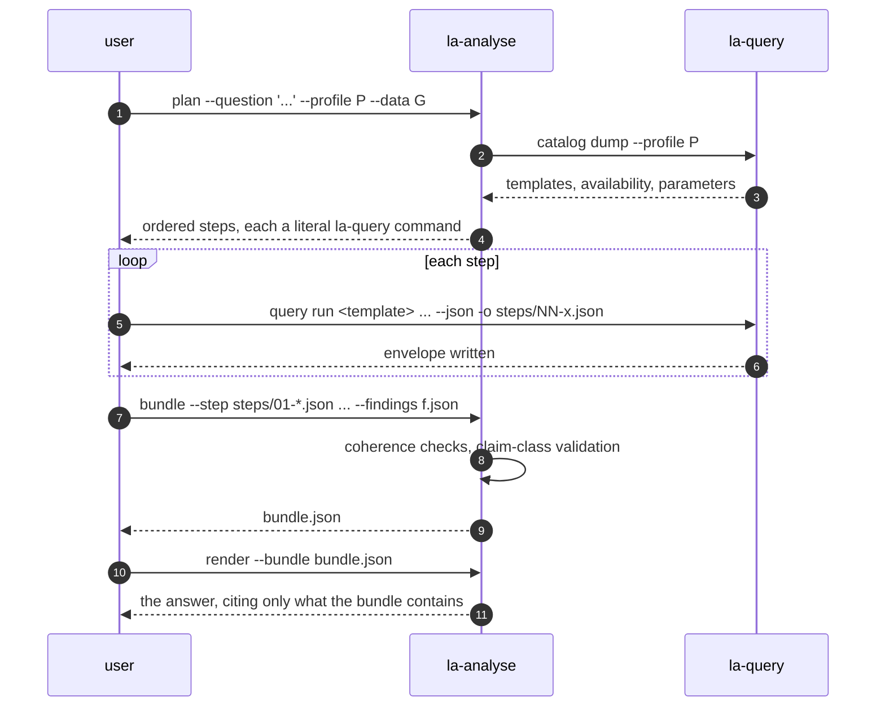
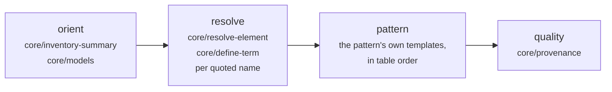
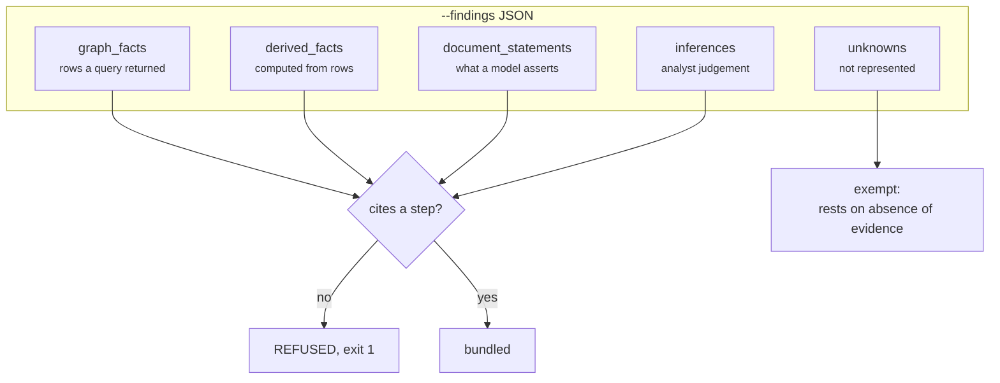

# linked-archi-analyse

Plan an architecture investigation and bundle its evidence. **This owner executes nothing.**

```
Exit codes: 0 done, 1 refused (unknown pattern, incoherent bundle, missing claim class,
            uncited claim), 2 error (unreadable file, malformed request).

This owner executes nothing. It emits the la-query commands to run and assembles the
envelopes they produce; execution, read-only enforcement and provenance stay with
linked-archi-query.
```

## Commands

| Command | Purpose |
|---|---|
| `plan --question TEXT` | Route the question to a pattern and emit the numbered steps to run. |
| `bundle --step FILE ...` | Assemble already-executed envelopes into one reviewable artifact. |
| `render --bundle FILE` | Generate the human answer from the artifact. |
| `doctor` | Report patterns loaded and companions found. |
| `_machine plan` / `_machine bundle` | Versioned JSON contract. |

## The loop



## `plan`

```bash
python3 scripts/la-analyse plan --question 'what depends on "Order Service"?' \
    --profile linked-archi-default --data graph.trig
```

| Flag | Default | Purpose |
|---|---|---|
| `--question TEXT` | — | The question. Quote the names you mean. |
| `--mode PATTERN` | routed | Name the pattern instead of routing to one. |
| `--list-patterns` | — | Print the routing table and exit. |
| `--profile NAME_OR_PATH` | — | The profile the plan's commands will use, and the one availability is read against. |
| `--data FILE` | `[]` | Repeatable. Not opened here. |
| `--endpoint URL` | — | Not contacted here. |
| `--budget N` | `12` | Steps beyond it are marked, never dropped. |
| `--steps-dir DIR` | `steps` | Where the planned commands write envelopes. |
| `--json` | off | Emit the plan as JSON. |

### Step order is doctrine



Orientation always comes first, so an empty later result can be told from a partial export.
Resolution comes next, so no step takes a hand-written IRI. Then the pattern's evidence. Then
provenance, so every load-bearing element can be traced to a source.

Templates are de-duplicated by `(template, parameters)`, which is why `core/provenance` — named by
two stages — is planned once and cited twice.

### Every step is a literal command

```
03 resolve      Turn "Order Service" into an IRI.
   $ la-query query run core/resolve-element --profile linked-archi-default --data graph.trig --set TERM='Order Service' --json -o steps/03-resolve-element.json
   establishes: the focus IRIs later steps take as parameters
   stop if: several candidates match and the choice changes the answer - ask instead of picking
```

Every step writes an envelope from step 01 onward, because the envelope *is* the evidence and a
terminal scroll cannot be turned back into one.

Parameters that cannot be known at planning time appear as visible placeholders naming their source,
rather than as invented values:

```
   FOCUS_IRI: <FOCUS_IRI: resolved in the resolve step, from core/resolve-element>
   PREDICATE_PATH: <PREDICATE_PATH: a predicate from core/discover-relationship-types>
```

`LIMIT` is skipped, and so is any parameter with a documented catalogue default — a documented
default beats a guess.

### Availability annotation, and its degrade path

With `--profile` and `la-query` reachable, `plan` runs `catalog dump` and annotates each step. A
refused template is replaced by its documented alternative **at planning time** rather than
mid-investigation:

```
08 pattern      Impact and dependency: evidence from core/dependents-direct.  [REFUSED by this profile]
   instead: core/dependents-qualified, core/neighbours-qualified
   note: capability 'direct_rel_triples' is False in profile 'linked-archi-default' but this template needs True
```

Every failure to reach the catalogue — companion missing, timeout, non-zero exit, invalid JSON,
wrong schema version — degrades rather than fails. The plan is still an ordered plan, availability
reads `unknown`, no `--set` flags are emitted, and the caller is told what is missing:

> linked-archi-query was not reachable, so no template parameters or availability could be read.
> Run `la-query catalog dump --profile P` and re-plan, or take parameters from
> `la-query catalog show <template>` as you go.

A template the routing table names but the installed catalogue lacks is skipped with a note saying
the two skills are probably different generations.

The budget is never enforced. Steps past it are marked `[OVER BUDGET]` so what you are giving up
stays visible.

## `bundle`

```bash
python3 scripts/la-analyse bundle --step steps/01-inventory-summary.json \
    --step steps/03-resolve-element.json --question 'what depends on "Order Service"?' \
    --findings findings.json -o bundle.json
```

| Flag | Required | Purpose |
|---|---|---|
| `--step FILE` | **yes** | Repeatable and order-significant. An envelope `la-query --json -o` wrote. |
| `--question TEXT` | no | The question this investigation answered. |
| `--findings FILE` | no | The interpretation. See the claim classes below. |
| `--dataset-revision REV` | no | Recorded as caller-supplied; this owner does not run git and will not guess. |
| `--markdown` | no | Emit the Markdown rendering instead of the JSON artifact. |

It re-executes nothing, and it refuses an incoherent bundle:

- More than one `dataset_id` → *One bundle is one dataset; a mixed one reads as reproducible and is
  not.*
- More than one `(profile_id, profile_version)` → *The same term can mean different things under two
  profiles, so the results are not comparable.*
- An envelope with a different `schema_version` → refused rather than read as a shape neither side
  agrees on.

Row snapshots are capped at 10 per step, with `rows_shown` and `rows_omitted` recorded, because a
bundle is for review rather than a data export — and a truncated snapshot of a truncated result
would otherwise be two floors deep with nothing recording either.

## The five claim classes

The discipline of this skill is that none of these silently becomes another, so the split must be
declared. An empty class is a statement; a missing class is an omission.



Every claim except an `unknowns` claim must cite at least one step, and a cited step number must
exist in the bundle. `unknowns` is the one class that legitimately cites nothing: "runtime call
volume is not represented" rests on the absence of evidence, not on a step.

```json
{
  "answer": "Three services reach Order Service within two hops.",
  "graph_facts": [{"claim": "Order Service is served by 3 application components", "steps": [5]}],
  "derived_facts": [],
  "document_statements": [{"claim": "the model marks two of them deprecated", "steps": [7]}],
  "inferences": [{"claim": "retiring it would need those two migrated first", "steps": [5, 7]}],
  "unknowns": [{"claim": "runtime call volume is not represented in these models"}]
}
```

## `render`

Generates the human answer from the artifact, so the answer cannot cite a query the bundle does not
contain. Section headings are fixed: **Graph facts**, **Derived from the graph**, **Document
statements**, **Analyst inference**, **Unknown, and why**. It states the dataset, the profile and
whether that profile was verified against this dataset, and when any step truncated it says so up
front:

> **A result was truncated.** Counts below are floors, not totals.
