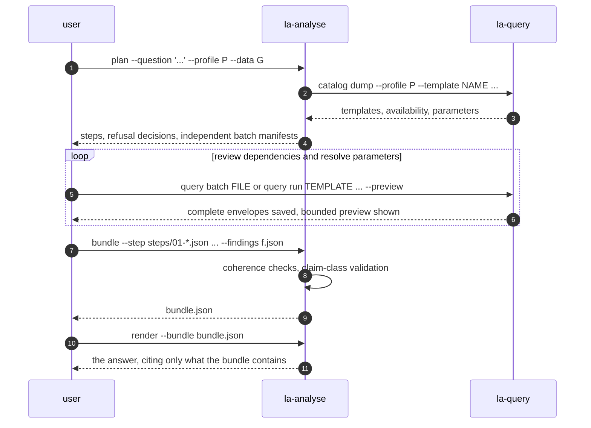
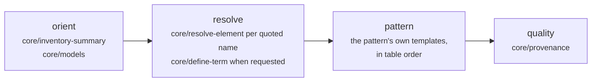
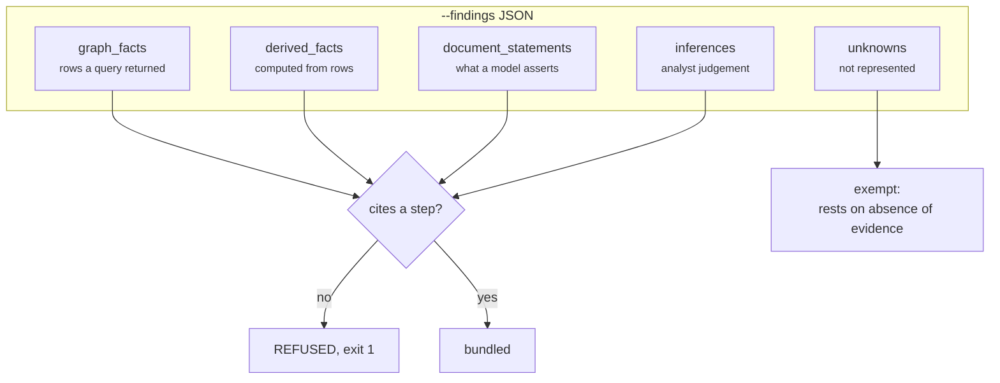

# linked-archi-analyse

Plan an architecture investigation and bundle its evidence. **This owner executes nothing.**

```
Exit codes: 0 done, 1 refused (unknown pattern, incoherent bundle, missing claim class,
            uncited claim), 2 error (unreadable file, malformed request).

This owner executes nothing. It emits the la-query commands to run and assembles the
envelopes they produce; execution, read-only enforcement and provenance stay with
linked-archi-query.
```

## Commands

| Command | Purpose |
|---|---|
| `plan --question TEXT` | Route the question to a pattern and emit the numbered steps to run. |
| `bundle --step FILE ...` | Assemble already-executed envelopes into one reviewable artifact. |
| `render --bundle FILE` | Generate the human answer from the artifact. |
| `doctor` | Report patterns loaded and companions found. |
| `_machine plan` / `_machine bundle` | Versioned JSON contract. |

## The loop


```mermaid
sequenceDiagram
  autonumber
  participant U as user
  participant A as la-analyse
  participant Q as la-query
  U->>A: plan --question '...' --profile P --data G
  A->>Q: catalog dump --profile P --template NAME ...
  Q-->>A: templates, availability, parameters
  A-->>U: steps, refusal decisions, independent batch manifests
  loop review dependencies and resolve parameters
    U->>Q: query batch FILE or query run TEMPLATE ... --preview
    Q-->>U: complete envelopes saved, bounded preview shown
  end
  U->>A: bundle --step steps/01-*.json ... --findings f.json
  A->>A: coherence checks, claim-class validation
  A-->>U: bundle.json
  U->>A: render --bundle bundle.json
  A-->>U: the answer, citing only what the bundle contains
```

## `plan`

```bash
python3 scripts/la-analyse plan --question 'what depends on "Order Service"?' \
    --profile linked-archi-default --data graph.trig --batch-dir batches
```

| Flag | Default | Purpose |
|---|---|---|
| `--question TEXT` | — | The question. Quote the names you mean. |
| `--mode PATTERN` | routed | Name the pattern instead of routing to one. |
| `--list-patterns` | — | Print the routing table and exit. |
| `--profile NAME_OR_PATH` | — | The profile the plan's commands will use, and the one availability is read against. |
| `--data FILE` | `[]` | Repeatable. Not opened here. |
| `--endpoint URL` | — | Not contacted here. |
| `--budget N` | `12` | Steps beyond it are marked, never dropped. |
| `--steps-dir DIR` | `steps` | Where the planned commands write envelopes. |
| `--definitions` | off | Add definition evidence even when the question does not explicitly ask for it. |
| `--batch-dir DIR` | — | Write manifests for independent concrete steps; execute nothing. |
| `--json` | off | Emit the plan as JSON. |

### Step order is doctrine


```mermaid
flowchart LR
  O["orient<br/><small>core/inventory-summary<br/>core/models</small>"] --> R["resolve<br/><small>core/resolve-element per quoted name<br/>core/define-term when requested</small>"]
  R --> P["pattern<br/><small>the pattern's own templates,<br/>in table order</small>"]
  P --> Q["quality<br/><small>core/provenance</small>"]
```

Orientation always comes first, so an empty later result can be told from a partial export.
Resolution comes next, so no step takes a hand-written IRI. Then the pattern's evidence. Then
provenance, so every load-bearing element can be traced to a source.

Orientation is freshly planned on every invocation. No previous envelope or verification
marker is used to skip it: the existing basename-based dataset identity cannot prove that
the current data is unchanged.

`core/define-term` is conditional, including when a pattern lists it among its candidates.
It is included for `--definitions`, or when the wording asks for a definition: `define`,
`definition`, `meaning`, `what does/do … mean`, or `what is/are "a quoted name"`.
Words inside quoted names do not trigger this choice, so "Definition Service"
is still just an entity name. An analyst should add `--definitions` when meaning or ambiguity
becomes material to the investigation. Name resolution and its stop condition for several
candidates remain in every plan.

Templates are de-duplicated by `(template, parameters)`, which is why `core/provenance` — named by
two stages — is planned once and cited twice.

### Commands carry evidence and dependencies

```
03 resolve      Turn "Order Service" into an IRI.
   $ la-query query run core/resolve-element --profile linked-archi-default --data graph.trig --set 'TERM=Order Service' --json -o steps/03-resolve-element.json --preview --limit 20
   review first: steps 1, 2
   establishes: the focus IRIs later steps take as parameters
   stop if: several candidates match and the choice changes the answer - ask instead of picking
```

Every executed step saves the full JSON envelope from step 01 onward, because the envelope
*is* the evidence. With the current query companion, `--preview --limit 20` shows a bounded
result with evidence identifiers, caveats and truncation information; it does not reduce
the saved rows or the query's limit. Legacy companion commands keep `--json -o` without the
preview flags.

Parameters that cannot be known at planning time appear as visible placeholders naming their source,
rather than as invented values:

```
   FOCUS_IRI: <FOCUS_IRI: resolved in the resolve step, from core/resolve-element>
   PREDICATE_PATH: <PREDICATE_PATH: a predicate from core/discover-relationship-types>
```

`LIMIT` is skipped, and so is any parameter with a documented catalogue default — a documented
default beats a guess.

Commands containing placeholders are plans, not executable queries yet. Resolve the values,
check profile availability, and review `depends_on` results and `review_decisions` first.
Pattern steps keep their evidence order: neighbours precede deeper dependency paths.

The JSON `status` describes planning readiness: `ready`, `awaiting-evidence`,
`awaiting-parameters`, `review-required`, or `unknown`. A `ready` step has known profile
availability, bound parameters and no outstanding planning dependencies. It does not certify
the dataset, enforce stop conditions, or provide a missing execution target. Profile gates
describe the configured profile; they are not verification against the data.

### Batch independent steps

`batches` groups at least two available steps with the same stage and dependencies. Every
entry has bound parameters and an individual envelope output path. An explicit `--data` or
`--endpoint` is required; unresolved, unknown, refused, decision-blocked and over-budget
steps never enter a manifest. A batch replaces its individual commands; do not execute both.

The two orientation queries are one ready batch. Multiple quoted names, or an explicitly
requested definition alongside resolution, can form a later resolution batch marked
`awaiting-evidence`. Review orientation and its stop conditions before running that batch.
Pattern steps retain separate review boundaries instead of guessing that their evidence is
independent.

With `--batch-dir batches`, the CLI writes these manifests without touching the dataset:

```bash
la-query query batch batches/01-orient.json --profile linked-archi-default \
    --data graph.trig --preview --limit 20
```

Without `--batch-dir`, manifests are embedded in JSON output and their suggested paths are
under `steps/batches`; no files are written. The machine plan command also only returns the
manifests, even when its `batch_dir` field supplies their intended directory. Query owns
execution, safety checking, and the complete result envelopes consumed by `bundle`.

### Availability annotation, and its degrade path

With `--profile` and `la-query` reachable, `plan` requests metadata only for its candidate
templates using repeated `catalog dump --template NAME` filters. Refused candidates become
`decisions`, outside the numbered query steps and budget. They never receive a command:

```
decision-1 [REFUSED] core/dependents-direct
   reason: capability 'direct_rel_triples' is False in profile 'linked-archi-default' but this template needs True
   alternatives to assess: core/dependents-qualified, core/neighbours-qualified
   Alternatives are not assumed to answer the same question.
```

There is no automatic substitution. For example, qualified two-hop paths do not establish
the same reachability as unbounded direct paths. Decisions preserve the reason, alternatives,
caveats and the requested template's `answers` and `does_not_prove`. Subsequent steps carry
the decision ID in `review_decisions` so the analyst must decide whether to narrow the
question, gather different evidence or stop.

A rejected filtered catalogue request retries a full dump for compatibility with older
query installations. Filtering and preview were introduced together, so a successful
filtered request enables preview flags. The fallback conservatively omits `--preview` and
`--limit` from both individual and batch commands while preserving complete saved envelopes.
If metadata still cannot be obtained — missing companion, timeout,
non-zero exit, invalid JSON or wrong schema version — the plan degrades rather than fails.
Availability reads `unknown`, no `--set` flags are emitted, no batches are offered, and the
caller is told what is missing:

> linked-archi-query was not reachable, so no template parameters or availability could be read.
> Run `la-query catalog dump --profile P` and re-plan, or take parameters from
> `la-query catalog show <template>` as you go.

A template the routing table names but the installed catalogue lacks is skipped with a note saying
the two skills are probably different generations.

Without `--profile`, catalogue metadata can still supply parameters, but availability remains
`unknown` and no batches are offered. `annotated: true` means metadata was read, not that the
profile or dataset was verified.

The budget is never enforced. Steps past it are marked `[OVER BUDGET]` so what you are giving up
stays visible; they remain in the plan but are excluded from generated batches.

## `bundle`

```bash
python3 scripts/la-analyse bundle --step steps/01-inventory-summary.json \
    --step steps/03-resolve-element.json --question 'what depends on "Order Service"?' \
    --findings findings.json -o bundle.json
```

| Flag | Required | Purpose |
|---|---|---|
| `--step FILE` | **yes** | Repeatable and order-significant. An envelope `la-query --json -o` wrote. |
| `--question TEXT` | no | The question this investigation answered. |
| `--findings FILE` | no | The interpretation. See the claim classes below. |
| `--dataset-revision REV` | no | Recorded as caller-supplied; this owner does not run git and will not guess. |
| `--markdown` | no | Emit the Markdown rendering instead of the JSON artifact. |

It re-executes nothing, and it refuses an incoherent bundle:

- More than one `dataset_id` → *One bundle is one dataset; a mixed one reads as reproducible and is
  not.*
- More than one `(profile_id, profile_version)` → *The same term can mean different things under two
  profiles, so the results are not comparable.*
- An envelope with a different `schema_version` → refused rather than read as a shape neither side
  agrees on.

Row snapshots are capped at 10 per step, with `rows_shown` and `rows_omitted` recorded, because a
bundle is for review rather than a data export — and a truncated snapshot of a truncated result
would otherwise be two floors deep with nothing recording either.

## The five claim classes

The discipline of this skill is that none of these silently becomes another, so the split must be
declared. An empty class is a statement; a missing class is an omission.


```mermaid
flowchart TD
  subgraph findings["--findings JSON"]
    GF["graph_facts<br/><small>rows a query returned</small>"]
    DF["derived_facts<br/><small>computed from rows</small>"]
    DS["document_statements<br/><small>what a model asserts</small>"]
    IN["inferences<br/><small>analyst judgement</small>"]
    UN["unknowns<br/><small>not represented</small>"]
  end
  GF --> C{"cites a step?"}
  DF --> C
  DS --> C
  IN --> C
  C -->|no| REF["REFUSED, exit 1"]
  C -->|yes| OK["bundled"]
  UN --> EX["exempt:<br/>rests on absence of evidence"]
```

Every claim except an `unknowns` claim must cite at least one step, and a cited step number must
exist in the bundle. `unknowns` is the one class that legitimately cites nothing: "runtime call
volume is not represented" rests on the absence of evidence, not on a step.

```json
{
  "answer": "Three services reach Order Service within two hops.",
  "graph_facts": [{"claim": "Order Service is served by 3 application components", "steps": [5]}],
  "derived_facts": [],
  "document_statements": [{"claim": "the model marks two of them deprecated", "steps": [7]}],
  "inferences": [{"claim": "retiring it would need those two migrated first", "steps": [5, 7]}],
  "unknowns": [{"claim": "runtime call volume is not represented in these models"}]
}
```

## `render`

Generates the human answer from the artifact, so the answer cannot cite a query the bundle does not
contain. Section headings are fixed: **Graph facts**, **Derived from the graph**, **Document
statements**, **Analyst inference**, **Unknown, and why**. It states the dataset, the profile and
whether that profile was verified against this dataset, and when any step truncated it says so up
front:

> **A result was truncated.** Counts below are floors, not totals.
