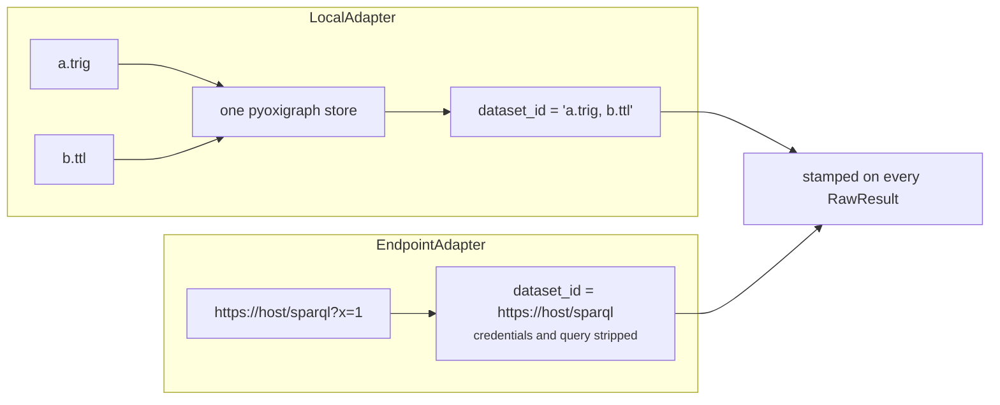

# linked-archi-connect

Discover and attach RDF datasets, and report what actually loaded. It selects nothing for you.

```
Exit codes: 0 attached, 2 error (nothing parsed, rejected endpoint, unresolvable companion,
            refused query).
`datasets` finding no candidates is exit 0 with an empty list: no dataset here is a finding,
not a failure.
```

## Commands

| Command | Purpose |
|---|---|
| `datasets [directory]` | Report candidate graph files. Chooses none. |
| `connect` | Load a target and describe what arrived. |
| `doctor` | Report this owner's location and companions. |
| `_machine execute` / `execute-many` | Versioned JSON contract; every query is linted first. |

### `datasets`

| Flag | Default | Purpose |
|---|---|---|
| `directory` | cwd plus its git root | Where to search. |
| `--include-fixtures` | off | Include paths that look like test data. |
| `--no-git` | off | Skip git provenance. |
| `--search-dir DIR` | see below | Repeatable. `.` is always included. |
| `--max-depth N` | `3` | Ceiling `12`. |
| `--extension EXT` | see below | Repeatable. |

Default search directories: `.`, `dist`, `build`, `out`, `target`, `graph`, `graphs`, `data`,
`architecture`, `models`, `model`. Default extensions: `.trig`, `.ttl`, `.turtle`, `.nt`, `.nq`,
`.nquads`, `.rdf`, `.jsonld`, `.n3` — `.json` and `.xml` are excluded as ambiguous. Paths
containing `fixtures`, `test`, `tests`, `example`, `examples` or `sample` are excluded unless
`--include-fixtures`.

Each candidate reports its shortest relative path, size, the git commit date or the mtime, and
`graphs: yes|no`. Where git data exists it adds the ref, the commit and whether the tree was clean.
It closes with a placeholder command rather than the first candidate:

```
Nothing is selected for you. Confirm which candidate is current, then:
  connect --data "<PATH from the list above>"
Repeat --data to merge several files into one store.
```

### `connect` and the target flags

Shared by `connect` and by the query, profile and analyse owners:

| Flag | Default | Purpose |
|---|---|---|
| `--data FILE` | `[]` | Repeatable; files merge into one dataset. Omit when `$LINKED_ARCHI_DATA` is set. |
| `--endpoint URL` | — | A read-only SPARQL endpoint instead of local files. |
| `--timeout-ms MS` | `30000` | Endpoint request deadline. Ignored for local files. |
| `--lenient` | off | Relax RDF parsing. Never relaxes query safety. |
| `--store {memory,cached,readonly,refresh}` | `memory` (via `$LINKED_ARCHI_STORE`) | Where the store comes from. |

Passing both `--data` and `--endpoint` is refused:

> Give either --data or --endpoint, not both. Two datasets would make the recorded dataset
> identity wrong, and a result that cites the wrong source is worse than no result.

Passing neither is also refused, with instructions rather than a fallback:

> No graph to query. Pass --data with one or more RDF files, or --endpoint with a read-only SPARQL
> URL. If neither is available, stop after producing candidate queries and label them unexecuted -
> do not describe results you have not seen.

## Dataset identity



Local identity is the comma-joined file basenames. Endpoint identity is the URL with credentials and
query string stripped. Either way it is stamped onto every result together with
`named_graphs_present`, the store description, `elapsed_ms` and `load_ms` — and load cost is
attributed only to the first result of a batch, so a batch does not pay for the load repeatedly in
its own reporting.

## The named-graph trap, handled loudly

Only TriG and N-Quads carry graph identity. A Turtle file lands entirely in the default graph, and
`use_default_graph_as_union` is deliberately left off so a missing `GRAPH` clause fails visibly
rather than quietly widening. Two warnings exist for it, verbatim:

```
warning: <files> input carries no graph identity, so everything from it landed in the default
graph. Any query scoped to a graph role will return nothing. Use TriG or N-Quads, or a profile
with layout 'single'.
```

```
warning: no named graphs in this dataset. Use a profile with layout 'single' from sibling
linked-archi-profile/assets/profiles/ or every scoped query returns nothing.
```

An unknown extension is refused with the known set and a specific caution: *a TriG file named
`.ttl` loads as Turtle and loses its graphs.*

## Store modes

| Mode | Behaviour |
|---|---|
| `memory` | Parse into memory. The default. |
| `cached` | Persist and reuse an on-disk store. Refuses rather than silently falling back. |
| `readonly` | Reuse only, never build. |
| `refresh` | Discard and rebuild. |

`cached` loads much faster and queries slower; read `load_ms` beside `elapsed_ms` to see which side
you are paying.

## Completeness: what did not load

If the project has an inputs manifest — `sources-index.yaml`, `sources-index.yml` or
`sources.yaml`, at or up to four parents above the loaded files — `connect` compares what loaded
against it and reports dropped sources. Without one, it reports sibling RDF files it noticed and did
not load. Notes print to stderr as `warning: <note>`.

It closes by handing over rather than guessing:

```
Which profile fits this dataset? Ask the profile owner, do not guess:
  la-profile recommend <target>
```

## Endpoints

POSTs `application/x-www-form-urlencoded`, accepting SPARQL JSON results first, then Turtle, then
N-Triples. Plain `http` is allowed but flagged unless the host is loopback. `named_graphs_present`
is `None` — unknown until something is queried. The description carries a reminder worth repeating:

> reminder: enforce read-only server-side too. This client refuses updates and SERVICE, but a
> client-side check is a guard, not a boundary.

## Environment

| Variable | Effect |
|---|---|
| `LINKED_ARCHI_DATA` | An explicit dataset. `os.pathsep`-separated, like `PATH`, because a federated graph is several files. |
| `LINKED_ARCHI_STORE` | Store mode when `--store` is unset. |
| `LINKED_ARCHI_STORE_CACHE` | Cache root, falling back to `$XDG_CACHE_HOME`. |
| `LINKED_ARCHI_STORE_KEEP` | Store directories kept per root. Default 3. |
| `LINKED_ARCHI_STORE_MAX_BYTES` | Byte budget for eviction. |
| `LINKED_ARCHI_SPARQL_TOKEN` | Bearer token for the endpoint. |
| `LINKED_ARCHI_SKILLS_DIR` | Authoritative companion root. |
