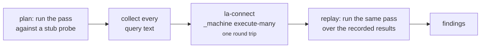

# linked-archi-profile

Resolve and verify the graph profile that tells queries what a dataset calls things. See
[The graph profile](../concepts/profile.md) for what a profile *is*; this page is the command
surface.

```
Exit codes: 0 ok, 1 drift found by verify (a claim in the profile is false about the dataset),
            2 error.
Exit 1 is a finding: read the report, then fix the profile or the dataset.
Nothing else here uses exit 1.
```

## Commands

| Command | Purpose | Needs companions |
|---|---|---|
| `list` | Bundled profiles, with what each describes. | no |
| `show` | One profile's claims, readably. `--json` for the resolved snapshot. | no |
| `resolve` | The fully merged profile as JSON. | no |
| `verify` | Check a profile's claims against a real dataset. | **yes** |
| `recommend` | Name a starting profile from the dataset's shape. | **yes** |
| `derive` | Draft a profile from a converter mapping or a metamodel. | no |
| `doctor` | Report this owner's location and companions. | no |
| `_machine resolve` | Versioned JSON contract. | no |

`verify` and `recommend` need both `la-connect` (to probe) and `la-query` (to lint every probe).
`list`, `show`, `resolve` and `derive` work alone.

`--profile NAME_OR_PATH` is looked up in this order: a path if it looks like one, then a bundled
name, then `examples/<name>`. Default `linked-archi-default`.

## `verify`

```bash
python3 scripts/la-profile verify --profile linked-archi-default --data graph.trig
python3 scripts/la-profile verify --profile linked-archi-default --data graph.trig --all
python3 scripts/la-profile verify --profile linked-archi-default --data graph.trig --emit-fix > child.yaml
```

| Flag | Purpose |
|---|---|
| `--all` | Include passing checks, which are hidden by default. |
| `--emit-fix` | Write a child profile to stdout, the report to stderr. |

Findings look like this — `FAIL` for error, `warn` for warning, `ok` for info:

```
warn notations.present   declared by the profile with no model conforming to them in this dataset:
                         plantuml. Questions about them can only ever come back empty. Recording
                         notations.<name>.present false turns that empty answer into a refusal
                         that says which dataset to ask instead.
```

### The probe contract

Probes are planned in one pass against a stub, executed in **one** round trip, then replayed
against the recorded results keyed by query text.



The consequence is a rule that shapes every probe in the skill: **the query set must not vary with
a probe's answer.** The planner answers `False` to every ASK, so a branch not taken while planning
but taken during replay asks a question that was never planned — which raises
`profile verification requested an unplanned probe` rather than returning a wrong answer. Probes may
branch on the profile and on engine support; never on another probe's result. Every question is
asked unconditionally into a dict and interpreted afterwards.

The probe adapter has only `ask` and `count`. There is no `select`, so joins that would otherwise
need a second round trip happen inside SPARQL instead.

### What verify checks

| Finding subject | Reports |
|---|---|
| `capabilities.<name>` | A claim contradicted by the data, or a measured `partial` where `true` or `false` was claimed. |
| `notations.present` | Which declared notations the dataset holds a model in, and any stale `present` claim. |
| `roles.<name>` | A bound role that nothing in this dataset uses. |
| `graphs.roles.<name>` | A required graph role that is missing. |
| `metamodel.manifest` | The data declares a metamodel whose manifest is not attached. |
| `metamodel.assets` | The manifest is attached but the assets it names are not. |
| `vocabulary.*` | The attached vocabulary does not cover the notations in use. |

A capability claim contradicted by the data is an **error** and carries a fix pair, so `--emit-fix`
can write it. Notation presence and metamodel pairing are **warnings**: no dataset is obliged to
hold every notation a profile can read, and an error there would make every bundled profile fail
against every real store.

## `recommend`

```bash
python3 scripts/la-profile recommend --data graph.trig
```

Measures the dataset's shape through the published vocabulary as a lens, then names one of the
bundled profiles with reasons and caveats. It **never applies anything**.

Observations include the named-graph count, which graph roles are populated, whether direct
relationship triples and the reification bridge are present, whether identity assertions and a SHACL
report exist, how membership is expressed, and which notations have models.

`recommend` and `verify` measure notation presence and the direct-triples capability the same way,
deliberately: two commands contradicting each other about one dataset is worse than either being
wrong alone, because it leaves the reader no way to decide.

## `derive`

Draft a profile for a custom metamodel rather than forking a bundled one.

```bash
python3 scripts/la-profile derive my-platform --type-mapping converter-mapping.yaml
python3 scripts/la-profile derive my-platform --metamodel metamodel.ttl --notation myslug
```

| Flag | Default | Purpose |
|---|---|---|
| `name` | required | The profile name. |
| `--type-mapping FILE` | — | A converter type-mapping YAML. |
| `--metamodel FILE` | — | A published `arch:Metamodel` manifest. |
| `--base-iri IRI` | — | The minted-IRI base. |
| `--notation SLUG` | — | The notation slug to declare. |
| `--extends PROFILE` | `linked-archi-default.yaml` | Parent profile. |
| `-o, --output FILE` | stdout | Where to write. |

!!! note "`--metamodel` reads one local file's direct declarations"
    It does not follow `owl:imports` and does not load a referenced corpus. Ontology acquisition is
    recorded as open work (O1 in `PROPOSAL.md`) precisely so this limit is not mistaken for a
    feature.

## Environment

| Variable | Effect |
|---|---|
| `LINKED_ARCHI_DATA` | Dataset used when neither `--data` nor `--endpoint` is given. |
| `LINKED_ARCHI_SKILLS_DIR` | Authoritative companion root. |
| `LINKED_ARCHI_LOCAL_DEADLINE_S` | Seconds ceiling on a local probe batch. Default 300. `none`, `0` or `off` opts out. |
| `LINKED_ARCHI_STATE_DIR` | Where the clean-verification marker is written. Default `~/.cache/linked-archi/verified`. |
