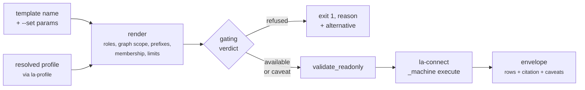

# linked-archi-query

Render and execute read-only SPARQL against an architecture graph. This owner holds the template
catalogue, read-only enforcement, execution and the result envelope.

```
Exit codes: 0 answered, 1 refused (unsupported template, or not read-only), 2 error.
Exit 1 is a routing answer, not a crash: read the reason and use the named alternative.
An empty result is exit 0 - a finding, not a failure.
```

## Command tree

```
la-query
├── catalog {list, show, dump}
├── query {render, run, literal, batch}
├── lint
├── doctor
└── _machine lint
```

## Browsing the catalogue

```bash
python3 scripts/la-query catalog list --profile linked-archi-default --why
python3 scripts/la-query catalog show core/traceability --profile linked-archi-default
python3 scripts/la-query catalog dump --profile linked-archi-default
```

In `catalog list`, `x` marks a template this profile refuses, `!` one that runs with a caveat, and
blank means available. `--why` explains every refusal and names an alternative.

`catalog show` is the authoritative parameter list — read it instead of the `.rq` file, because it
carries the typing, what the template does not prove, and its alternatives. Fields printed: `name`,
`file`, `stage`, `notation`, `purpose`, `answers`, `does not prove`, `caveat`, `parameters`,
`requires` (roles, graph roles, capability, membership), `alternatives`, then availability under the
named profile.

`catalog dump` emits the whole catalogue as JSON with per-template `available`, `unmet` and
`profile_caveats`. This is exactly the call `la-analyse` makes to annotate a plan.

## Running a query



| Subcommand | Purpose |
|---|---|
| `query render <template>` | Print the rendered SPARQL. `--force` renders a refused template for inspection only. |
| `query run <template>` | Render, lint, execute, print the envelope. |
| `query literal --query/--file` | The same for an ad-hoc query. Cited as `ad-hoc query`. |
| `query batch <manifest>` | Several queries from a JSON manifest, one store load. |

Flags on `run` and `literal`:

| Flag | Default | Purpose |
|---|---|---|
| `--profile NAME_OR_PATH` | `linked-archi-default` | Which profile to render against. |
| `--set NAME=VALUE` | — | Repeatable. Template parameter. An IRI works with or without angle brackets. |
| `--format {tsv,md,json}` | `tsv` | How to print. |
| `--json` | off | The same as `--format json`. `--format` wins if both appear. |
| `--limit N` | `100` | Rows to **print**. A display cap only. |
| `-o, --output FILE` | stdout | Writes the envelope as JSON regardless of `--format`. |

!!! warning "`--limit` is not the query's limit"
    `--limit` bounds what is printed. It does not bound the query, the work, or what `-o` and
    `--json` write. The query's own cap is `--set LIMIT=N`, and hitting it is what sets `truncated`.

### `query batch`

A manifest with `schema_version: 1` and a non-empty `queries` array; each entry takes exactly one of
`template`, `file` or `query`, plus optional `id`, `set` and `out`. One store load serves them all.

## `lint`

The first move on a hand-written query that returned nothing: far more often broken than evidence of
absence.

```bash
python3 scripts/la-query lint --query 'SELECT ?s WHERE { ?s ?p ?o }'
```

```
OK: read-only (inline query)
paths: not checked (no --data or --endpoint given)
```

With `--data` it also checks the path against the published SHACL — see
[the path check](../concepts/evidence.md#the-path-check). Only a non-read-only query, or missing
input, exits 1; an impossible path reports and exits 0.

## The four things that break naive SPARQL here

These are the reasons the templates exist, and the reasons a hand-written query usually returns
nothing.

**1. The qualified form is the default.** A relationship is a resource, not a triple. There is no
`?a am:serves ?b` unless the converter was run with `--emit-direct-rel-triples`:

```sparql
?rel a am:Serving ; arch:source ?a ; arch:target ?b .
```

**2. Graph scope is mandatory.** Concepts, views, provenance and model resources live in different
named graphs, and the default graph is not their union. A query with no `GRAPH` clause returns
nothing on a graph-partitioned dataset — and a query *with* one returns nothing on a flattened
Turtle export. The templates render the right shape from the profile's layout.

**3. Direction matters and fails silently.** Reversing `arch:source` and `arch:target` returns no
rows rather than an error.

**4. A label is not an identifier.** IRIs are minted as
`{base}{notation}/{modelId}/element/{localId}` and the local id is the source tool's. Never
construct one from a label; resolve it with `core/resolve-element`.

## Never substitute something else for a query

The point of this skill is that an answer is attributable: a named template, a rendered query, a
dataset identity, a profile version. Anything that bypasses that loses all of it.

- **Do not grep the RDF.** `grep` on a `.trig` file cannot resolve a label to an IRI, cannot scope
  to a graph, and produces no provenance.
- **Do not load the graph with another RDF library** to answer a question. That skips read-only
  enforcement, profile resolution and the envelope.
- **Do not search the repository** for facts the graph is supposed to supply.

If the tooling cannot be resolved, say so and stop — `la-query doctor` names what is missing. If no
dataset is attached, report that rather than looking for one.

## Environment

| Variable | Effect |
|---|---|
| `LINKED_ARCHI_DATA` | Dataset used when neither `--data` nor `--endpoint` is given. |
| `LINKED_ARCHI_STORE` | Store mode when `--store` is unset. |
| `LINKED_ARCHI_SKILLS_DIR` | Authoritative companion root. |
| `LINKED_ARCHI_LOCAL_DEADLINE_S` | Seconds ceiling on local execution. Default 300. |
| `LINKED_ARCHI_LOCAL_MAX_RSS_MB` | Memory ceiling for local execution, scaled by input size. |
