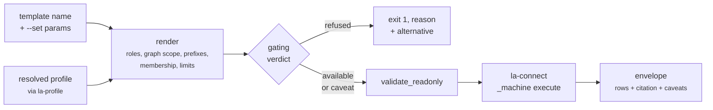

# linked-archi-query

Render and execute read-only SPARQL against an architecture graph. This owner holds the template
catalogue, read-only enforcement, execution and the result envelope.

```
Exit codes: 0 answered, 1 refused (unsupported template, or not read-only), 2 error.
Exit 1 is a routing answer, not a crash: read the reason and use the named alternative.
An empty result is exit 0 - a finding, not a failure.
```

## Command tree

```
la-query
├── catalog {list, show, dump}
├── query {render, run, literal, batch}
├── lint
├── doctor
└── _machine lint
```

## Browsing the catalogue

```bash
python3 scripts/la-query catalog list --profile linked-archi-default --why
python3 scripts/la-query catalog show core/traceability --profile linked-archi-default
python3 scripts/la-query catalog dump --profile linked-archi-default \
  --template core/neighbours-qualified --template core/dependents-qualified
python3 scripts/la-query catalog dump --profile linked-archi-default --stage analysis --notation bpmn
```

In `catalog list`, `x` marks a template this profile refuses, `!` one that runs with a caveat, and
blank means available. `--why` explains every refusal and names an alternative.

`catalog show` is the authoritative parameter list — read it instead of the `.rq` file, because it
carries the typing, what the template does not prove, and its alternatives. Fields printed: `name`,
`file`, `stage`, `notation`, `purpose`, `answers`, `does not prove`, `caveat`, `parameters`,
`requires` (roles, graph roles, capability, membership), `alternatives`, then availability under the
named profile.

`catalog dump` retrieves full metadata for selected entries as JSON. Repeat `--template` to request
known candidates together; use `--stage` or `--notation` to narrow discovery. Repeated values of the
same filter match any value; different filter kinds must all match. For example, two `--template`
values select either template, while `--stage analysis --notation bpmn` selects only BPMN analysis
templates. Unknown filter values fail rather than silently returning a partial catalogue.

With `--profile`, each selected entry also carries `available`, `unmet` and `profile_caveats`.
`la-analyse` requests the entries needed to annotate its investigation plan. The `schema_version: 1`
payload and complete entry metadata remain the same with filters; without filters, `catalog dump`
still emits the whole catalogue. Prefer a selected dump when only a few templates are relevant.

### Project-owned catalogue extensions

A downstream skill may package a project-owned `catalog.json` and its `.rq` files,
as the fixed-graph example does. Packaging does not register the queries: pass the
catalogue explicitly to `catalog list`, `show` or `dump`, or to `query render`,
`run` or `batch` after installing the package with the `agent-skills` target:

```bash
python3 .agents/skills/linked-archi-query/scripts/la-query catalog show demo/accountability \
  --catalog .agents/skills/fixed-graph-demo/assets/queries/catalog.json \
  --profile .agents/skills/fixed-graph-demo/assets/profiles/demo.yaml
python3 .agents/skills/linked-archi-query/scripts/la-query query run demo/accountability \
  --catalog .agents/skills/fixed-graph-demo/assets/queries/catalog.json \
  --profile .agents/skills/fixed-graph-demo/assets/profiles/demo.yaml \
  --data .agents/skills/fixed-graph-demo/assets/data/architecture.trig \
  --set FOCUS_IRI=https://example.org/fixed-graph/catalog/element/payments-service
```

Run these from the consumer project after installing the example's pinned
`v0.8.0` dependency. Publish that upstream tag before resolving the package.

`--catalog` is repeatable. Each extension uses the bundled catalogue's JSON schema, names its
own relative `.rq` files, and gives each template a project namespace such as `acme/`.
Duplicate names and file paths escaping the catalogue directory are refused; no working-directory
scan or automatic registration occurs. Use full names such as `demo/accountability`:
basename shortcuts can become ambiguous across catalogues. External entries go through the same
profile gates,
rendering, read-only check and result envelope as bundled entries. Keep project-specific fixture
tests with the extension: the upstream test floor covers bundled templates only. Treat the
catalogue path as a trust decision, not a sandbox for untrusted SPARQL, and keep endpoint
credentials read-only.

Registering a template does not add an `la-analyse` pattern or make the planner select it.
Analyse still investigates and orchestrates; it may inspect an explicitly supplied project
query, but only query executes it. The [downstream APM example](../downstream-apm.md) shows
the selected-skill package and the explicit graph/profile/catalogue choices together.

## Generating SPARQL without execution

For a known profile and template, inspect its parameter contract and render it directly:

```bash
python3 scripts/la-query catalog show core/neighbours-qualified --profile linked-archi-default
python3 scripts/la-query query render core/neighbours-qualified --profile linked-archi-default \
  --set FOCUS_IRI=https://example.org/la/bpmn/order-fulfillment/element/Task_Payment -o neighbours.rq
```

Rendering checks typed parameters, profile capability gates and query safety without opening a
dataset. It produces candidate SPARQL, not findings about a graph. Question investigation,
orientation, evidence review and orchestration belong to [linked-archi-analyse](analyse.md); they
are not prerequisites for generating a requested query. Resolve an unknown identifier before
execution rather than inventing it from a label.

## Running a query


```mermaid
flowchart LR
  T["template name<br/>+ --set params"] --> R["render<br/><small>roles, graph scope, prefixes,<br/>membership, limits</small>"]
  P["resolved profile<br/><small>via la-profile</small>"] --> R
  R --> G{"gating<br/>verdict"}
  G -->|refused| X["exit 1, reason<br/>+ alternative"]
  G -->|"available<br/>or caveat"| L["validate_readonly"]
  L --> E["la-connect<br/>_machine execute"]
  E --> V["envelope<br/><small>rows + citation + caveats</small>"]
```

| Subcommand | Purpose |
|---|---|
| `query render <template>` | Print the rendered SPARQL. `--force` renders a refused template for inspection only. |
| `query run <template>` | Render, lint, execute, print the envelope. |
| `query literal --query/--file` | The same for an ad-hoc query. Cited as `ad-hoc query`. |
| `query batch <manifest>` | Several queries from a JSON manifest, one store load. |

Flags on `run` and `literal` (`--set` applies to `run` only):

| Flag | Default | Purpose |
|---|---|---|
| `--profile NAME_OR_PATH` | `linked-archi-default` | Which profile to render against. |
| `--set NAME=VALUE` | — | Repeatable. Template parameter. An IRI works with or without angle brackets. |
| `--format {tsv,md,json}` | `tsv` | How to print. |
| `--json` | off | The same as `--format json`. `--format` wins if both appear. |
| `--limit N` | `100` | Rows to **print**. A display cap only. |
| `-o, --output FILE` | stdout | Writes the envelope as JSON regardless of `--format`. |
| `--preview` | off | With `-o`, also print a bounded preview with caveats and citation. |

!!! warning "`--limit` is not the query's limit"
    `--limit` bounds what is printed. It does not bound the query, the work, or what `-o` and
    `--json` write. The query's own cap is `--set LIMIT=N`, and hitting it is what sets `truncated`.

### Save evidence and inspect it in one call

```bash
python3 scripts/la-query query run core/inventory-summary --data architecture.trig \
  -o steps/inventory.json --preview --limit 20
```

For `run` and `literal`, `--preview` requires `-o` and a positive `--limit`; invalid combinations
are refused before profile resolution or query execution. The file retains the full JSON envelope,
including the query, every returned row, warnings, truncation and provenance. The preview uses TSV
regardless of `--format` or `--json`, and displays at most `--limit` rows with the existing caveats,
truncation warning and citation. ASK and empty results retain their existing guidance. CONSTRUCT
previews limit physical output lines and warn when the displayed fragment is not a complete RDF
document; the saved triples remain intact.

Without `--preview`, `-o` keeps its existing behavior: save the envelope and print the file location.
Saving all returned rows does not make a query capped by `LIMIT` complete; its `truncated` warning
still applies.

### `query batch`

A manifest with `schema_version: 1` and a non-empty `queries` array; each entry takes exactly one of
`template`, `file` or `query`, plus optional `id`, `set` and `out`. One store load serves them all.

```json
{
  "schema_version": 1,
  "queries": [
    {"id": "models", "template": "core/models", "out": "steps/models.json"},
    {"id": "inventory", "template": "core/inventory-summary", "out": "steps/inventory.json"}
  ]
}
```

Save that manifest as `batch.json`, then:

```bash
python3 scripts/la-query query batch batch.json --data architecture.trig --preview --limit 20 \
  -o batch-summary.txt
```

Each manifest `out` saves that result's complete JSON envelope. Batch `-o` saves the run summary,
not an envelope or the previews. `--preview` additionally prints each result's bounded evidence,
caveats and citation to stdout, even when the summary is saved. Batch previews do not require `-o`;
use manifest `out` entries to retain evidence for `la-analyse bundle`. Without `--preview`, batch
output remains the summary. `--limit` is per preview and does not change query limits or saved data.

Batch independent queries whose parameters are already known. Investigations use
`la-analyse plan --batch-dir DIR` to prepare eligible manifests; review prerequisite results before
running later groups, and run each batch instead of its individual commands. Analyse plans and
orchestrates; query owns execution, safety checks and envelopes.

## `lint`

The first move on a hand-written query that returned nothing: far more often broken than evidence of
absence.

```bash
python3 scripts/la-query lint --query 'SELECT ?s WHERE { ?s ?p ?o }'
```

```
OK: read-only (inline query)
paths: not checked (no --data or --endpoint given)
```

With `--data` it also checks the path against the published SHACL — see
[the path check](../concepts/evidence.md#the-path-check). Only a non-read-only query, or missing
input, exits 1; an impossible path reports and exits 0.

## The four things that break naive SPARQL here

These are the reasons the templates exist, and the reasons a hand-written query usually returns
nothing.

**1. The qualified form is the default.** A relationship is a resource, not a triple. There is no
`?a am:serves ?b` unless the converter was run with `--emit-direct-rel-triples`:

```sparql
?rel a am:Serving ; arch:source ?a ; arch:target ?b .
```

**2. Graph scope is mandatory.** Concepts, views, provenance and model resources live in different
named graphs, and the default graph is not their union. A query with no `GRAPH` clause returns
nothing on a graph-partitioned dataset — and a query *with* one returns nothing on a flattened
Turtle export. The templates render the right shape from the profile's layout.

**3. Direction matters and fails silently.** Reversing `arch:source` and `arch:target` returns no
rows rather than an error.

**4. A label is not an identifier.** IRIs are minted as
`{base}{notation}/{modelId}/element/{localId}` and the local id is the source tool's. Never
construct one from a label; resolve it with `core/resolve-element`.

## Never substitute something else for a query

The point of this skill is that an answer is attributable: a named template, a rendered query, a
dataset identity, a profile version. Anything that bypasses that loses all of it.

- **Do not grep the RDF.** `grep` on a `.trig` file cannot resolve a label to an IRI, cannot scope
  to a graph, and produces no provenance.
- **Do not load the graph with another RDF library** to answer a question. That skips read-only
  enforcement, profile resolution and the envelope.
- **Do not search the repository** for facts the graph is supposed to supply.

If the tooling cannot be resolved, say so and stop — `la-query doctor` names what is missing. If no
dataset is attached, report that rather than looking for one.

## Environment

| Variable | Effect |
|---|---|
| `LINKED_ARCHI_DATA` | Dataset used when neither `--data` nor `--endpoint` is given. |
| `LINKED_ARCHI_STORE` | Store mode when `--store` is unset. |
| `LINKED_ARCHI_SKILLS_DIR` | Authoritative companion root. |
| `LINKED_ARCHI_LOCAL_DEADLINE_S` | Seconds ceiling on local execution. Default 300. |
| `LINKED_ARCHI_LOCAL_MAX_RSS_MB` | Memory ceiling for local execution, scaled by input size. |
