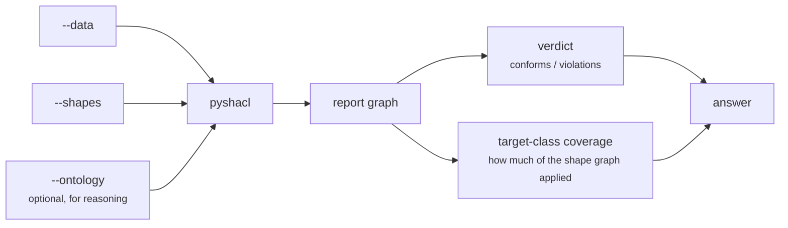

# linked-archi-validate

Run SHACL over an architecture graph in-process, or read a report someone else produced. No
converter, no JVM, no network.

```
Exit codes: 0 conforms, 1 results reported, 2 could not run.
Exit 1 is a finding, not a crash: read the report and carry on.
```

## Commands

| Command | Purpose |
|---|---|
| `run --data F --shapes F` | Validate data against shapes, in-process. |
| `report <file>` | Summarise a SHACL report that already exists. |
| `doctor` | Report whether `pyshacl` and `rdflib` are available. |
| `_machine validate` / `_machine report` | Versioned JSON contract. |

### `run`

| Flag | Required | Purpose |
|---|---|---|
| `--data FILE` | **yes** | Repeatable; several files merge into one graph. |
| `--shapes FILE` | **yes** | Repeatable. |
| `--ontology FILE` | no | Loaded for reasoning. Adds to the data, never replaces shapes. |
| `--no-rdfs-reasoning` | no | Disable `rdfs:subClassOf` reasoning, which changes which shapes match. |
| `--data-format FMT` | no | Override the parser for `--data`. |
| `-r, --report FILE` | no | Also write the report as Turtle. |
| `--json` | no | Emit the versioned JSON result. |
| `--limit N` | no | Findings to show, default 25. Counts are always complete. |

!!! warning "Shapes are never bundled"
    Pass local files, or acquire the published ones with `la-source` and pass the cached paths. A
    validator shipping its own copy of the rules would answer against a version nobody chose.

## The verdict is read beside its coverage



A run that selected no focus node is a **configuration failure, not a pass**. That case exits 2
even when the report says `sh:conforms true`, so no caller can mistake it for conformance. This is
the same class of error as reading an empty result as absence: `pyshacl` will happily report
conformance against shapes that matched nothing at all.

Coverage is therefore reported next to the verdict, not instead of it: how many target classes the
shape graph declares, and how many of them actually appeared in the data.

## Reading a report someone else produced

```bash
python3 scripts/la-validate report graph-shacl-report.ttl
```

Takes a report in any RDF serialisation. Useful when the pipeline that published the data also
published its validation output — in which case the report may already be a named graph inside the
dataset, and `core/validation-summary` in the query catalogue reads it from there instead (gated on
the `validation_in_graph` capability).

## When to use which

| Situation | Use |
|---|---|
| You have shapes and want a fresh verdict | `la-validate run` |
| A report file already exists | `la-validate report` |
| The report is loaded as a named graph in the dataset | `core/validation-summary` via `la-query` |
| The question is about model quality that no shape covers | the `model-quality` [analysis pattern](../patterns.md) |

!!! note "Do not run this as a background check on other work"
    Validation answers "does this conform to these shapes". It is not a general model-quality
    measure, and running it unasked produces a verdict nobody requested against shapes nobody chose.
