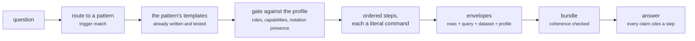

# Conversational analysis

A question in natural language, turned into a planned series of catalogued SPARQL queries, ending in
an answer where every claim cites the query that produced it.

This is the "text to SPARQL" path, with the generation step replaced by **routing**. No SPARQL is
written from the question. The question selects a method, the method names templates that were
already tested, and the profile decides which of them this dataset can support.

Everything below was run against `fixtures/base.trig`, which ships with the package. The output is
copied from those runs.

## Why routing rather than generation

A model writing SPARQL from a question has to guess the vocabulary, the relationship form, the graph
scope and the direction of every edge. Each guess fails the same way: zero rows, no error, and an
answer that reads as "there are none of those". Routing removes the guessing:



## Step 1 — plan

```bash
python3 scripts/la-analyse plan \
    --question 'what depends on "Payments Gateway"?' \
    --profile linked-archi-default --data fixtures/base.trig --steps-dir /tmp/walk
```

The name is quoted, deliberately. Quoted spans are what the planner turns into resolve steps;
without them, resolution carries a placeholder instead of inventing a term.

```
question   what depends on "Payments Gateway"?
pattern    impact-and-dependency — Impact and dependency
read       references/patterns/impact-and-dependency.md
ranked     impact-and-dependency(1)
budget     12 queries; 9 step(s) planned
annotated  yes, against the profile

01 orient       Which notations loaded, and how much of each.
   $ la-query query run core/inventory-summary --profile linked-archi-default --data fixtures/base.trig --json -o /tmp/walk/01-inventory-summary.json
   establishes: what is actually loaded, so an empty later result can be told from a partial export
   stop if: only one notation loaded and the question needs two
...
03 resolve      Turn "Payments Gateway" into an IRI.
   $ la-query query run core/resolve-element --profile linked-archi-default --data fixtures/base.trig --set TERM='Payments Gateway' --json -o /tmp/walk/03-resolve-element.json
   establishes: the focus IRIs later steps take as parameters
   stop if: several candidates match and the choice changes the answer - ask instead of picking
...
06 pattern      Impact and dependency: evidence from core/neighbours-qualified.
   $ la-query query run core/neighbours-qualified --profile linked-archi-default --data fixtures/base.trig --set FOCUS_IRI=<FOCUS_IRI: resolved in the resolve step, from core/resolve-element> --json -o /tmp/walk/06-neighbours-qualified.json
   establishes: the pattern's own evidence
   FOCUS_IRI: <FOCUS_IRI: resolved in the resolve step, from core/resolve-element>
...
08 pattern      Impact and dependency: evidence from core/dependents-direct.  [REFUSED by this profile]
   instead: core/dependents-qualified, core/neighbours-qualified
   note: capability 'direct_rel_triples' is False in profile 'linked-archi-default' but this template needs True

stop the investigation when:
  - the relationship semantics on a path stop supporting the claim
  - reachability has been established but criticality has not - they are different questions
  - the next hop needs data the models do not carry, such as traffic or failure history
```

Three things happened here that a generated query cannot do.

**A refusal arrived before any work.** Step 08 wants `core/dependents-direct`, which needs the direct
relationship triple. This dataset was converted without that flag, so the step is marked refused at
*planning* time and its documented alternatives are named. The investigation loses nothing: steps 06
and 07 answer the same question through the qualified form.

**Unknown parameters are visible.** `FOCUS_IRI` is a placeholder naming where its value comes from,
not a guess. The plan cannot be executed by accident with an invented IRI.

**The stopping conditions came with the method.** "Reachability has been established but criticality
has not" is the mistake this pattern exists to prevent, and it is attached to the plan rather than
left to the analyst's memory.

## Step 2 — execute, in order

Each step writes an envelope. Step 03 produces the IRI that later steps consume:

```bash
python3 scripts/la-query query run core/resolve-element --data fixtures/base.trig \
    --set TERM='Payments Gateway' --json -o /tmp/walk/03-resolve-element.json

FOCUS=https://example.org/la/leanix/leanix-inventory/element/a1000000-0000-4000-8000-000000000001

python3 scripts/la-query query run core/neighbours-qualified --data fixtures/base.trig \
    --set FOCUS_IRI="$FOCUS" --json -o /tmp/walk/06-neighbours-qualified.json
python3 scripts/la-query query run core/dependents-qualified --data fixtures/base.trig \
    --set FOCUS_IRI="$FOCUS" --json -o /tmp/walk/07-dependents-qualified.json
```

What the orientation step established:

```
metamodel	models	graphs	concepts
https://meta.linked.archi/archimate3/metamodel#ArchiMate3.2	1	1	38
https://meta.linked.archi/leanix/metamodel#LeanIXv4	1	1	15
https://meta.linked.archi/backstage/metamodel#BackstageCatalog	1	1	13
https://meta.linked.archi/bpmn/metamodel#BPMN2	1	1	10
https://meta.linked.archi/c4/metamodel#C4Model	1	1	5
```

Five notations, so a cross-notation question is at least possible. The neighbours step returned five
relationships:

| direction | relType | otherLabel |
|---|---|---|
| incoming | `leanix:OrganizationalUsage` | Finance |
| outgoing | `leanix:InterfaceOwnership` | Payment Authorisation API |
| outgoing | `leanix:PlatformMembership` | Customer Data Platform |
| outgoing | `leanix:Requiring` | PostgreSQL 16 |
| outgoing | `leanix:Supporting` | Order Management |

And the dependents step, one row:

| hops | dependentLabel | firstType |
|---|---|---|
| 1 | Finance | `leanix:OrganizationalUsage` |

Row counts for the whole run: 5, 5, 2, 10, 52, 5, 1, 2 — nothing truncated, so no count in the
answer is a floor.

## Step 3 — interpret, in five separated classes

The interpretation is a file, not prose in a chat window, and it must separate what the graph said
from what you concluded:

```json
{
  "answer": "One thing depends on Payments Gateway in these models: the Finance organisation uses it. Nothing else reaches it.",
  "graph_facts": [
    {"claim": "One dependent within two hops: Finance, via OrganizationalUsage", "steps": [7]},
    {"claim": "It has 5 direct relationships: 1 incoming from Finance, 4 outgoing", "steps": [6]}
  ],
  "derived_facts": [
    {"claim": "Its outgoing edges outnumber incoming 4 to 1, so it is a consumer of platform services more than a dependency of others", "steps": [6]}
  ],
  "document_statements": [
    {"claim": "The LeanIX inventory is the only model that describes it", "steps": [1, 4]}
  ],
  "inferences": [
    {"claim": "Retiring it would need only the Finance usage renegotiated, as far as these models record", "steps": [6, 7]}
  ],
  "unknowns": [
    {"claim": "Runtime call volume and failure history are not represented in any of these models"},
    {"claim": "Whether the ArchiMate model describes the same system under a different name - no identity assertions exist in this dataset"}
  ]
}
```

## Step 4 — bundle, which is where the discipline is enforced

```bash
python3 scripts/la-analyse bundle \
    --step /tmp/walk/01-inventory-summary.json ... --step /tmp/walk/09-provenance.json \
    --question 'what depends on "Payments Gateway"?' \
    --findings /tmp/walk/findings.json -o /tmp/walk/bundle.json
```

```
Wrote /tmp/walk/bundle.json (8 step(s), dataset base.trig, profile linked-archi-default v2)
caveat: this profile was never verified against this dataset. Settle it with `la-profile verify` - an unfitting profile fails silently.
```

These are the refusals, run against this very bundle:

=== "A claim citing no step"

    ```console
    $ la-analyse bundle --step 01-inventory-summary.json --findings bad.json
    Refused: findings.graph_facts[0] cites step(s) [3], which are not in this bundle (have: [1])
    exit=1
    ```

    A claim may not cite evidence the bundle does not carry. `unknowns` is the one exempt class: it
    rests on the absence of evidence, not on a step.

=== "A missing claim class"

    ```console
    $ la-analyse bundle --step 01-inventory-summary.json --findings no-unknowns.json
    Refused: findings must declare every claim class, even when empty: missing unknowns. An empty
    class is a statement; a missing one is an omission.
    exit=1
    ```

=== "Two datasets in one bundle"

    ```console
    $ la-analyse bundle --step from-base.json --step from-augmented.json
    Refused: these steps ran against different datasets: augmented.trig, base.trig. One bundle is
    one dataset; a mixed one reads as reproducible and is not.
    exit=1
    ```

## Step 5 — render the answer from the artifact

```bash
python3 scripts/la-analyse render --bundle /tmp/walk/bundle.json
```

```markdown
# what depends on "Payments Gateway"?

- Dataset: `base.trig`
- Profile: `linked-archi-default` v2 (**not verified** against this dataset)
- Steps: 8

## Caveats carried from the queries
- profile 'linked-archi-default' has not been verified against this dataset. A profile that does
  not fit fails silently - scoped queries return nothing, or rows that mean something else.

## Answer
One thing depends on Payments Gateway in these models: the Finance organisation uses it. Nothing
else reaches it.

## Graph facts
- One dependent within two hops: Finance, via OrganizationalUsage (step 7)
- It has 5 direct relationships: 1 incoming from Finance, 4 outgoing (step 6)

## Derived from the graph
- Its outgoing edges outnumber incoming 4 to 1, so it is a consumer of platform services more than
  a dependency of others (step 6)

## Document statements
- The LeanIX inventory is the only model that describes it (step 1, step 4)

## Analyst inference
- Retiring it would need only the Finance usage renegotiated, as far as these models record (step 6, step 7)

## Unknown, and why
- Runtime call volume and failure history are not represented in any of these models
- Whether the ArchiMate model describes the same system under a different name - no identity
  assertions exist in this dataset

## Queries
### Step 1: core/inventory-summary (5 row(s))
`37548aa0dea1` at 2026-09-16T23:41:16.379623+00:00
```

Every query follows in full, in a fenced block. The answer is generated **from** the artifact, so it
cannot cite a query the bundle does not contain.

Note what the rendering says about itself: the profile was never verified against this dataset, so
the answer carries that in its header rather than in a footnote. Settle it with `la-profile verify`
before quoting the answer anywhere that matters.

## What made the answer checkable

| Property | Where it came from |
|---|---|
| The question selected a tested method, not generated SPARQL | routing table, 9 patterns |
| A template the dataset cannot support was refused before running | profile gating, at planning time |
| No IRI was invented | `core/resolve-element`, a placeholder until resolved |
| Every count is exact rather than a floor | nothing truncated, and truncation would have said so |
| Each claim names its evidence | claim classes, uncited claims refused |
| Conclusions are separated from facts | `inferences` versus `graph_facts` |
| What the models cannot answer is stated | `unknowns`, the one class exempt from citation |
| The answer cannot outrun its evidence | rendered from the bundle, not typed beside it |
